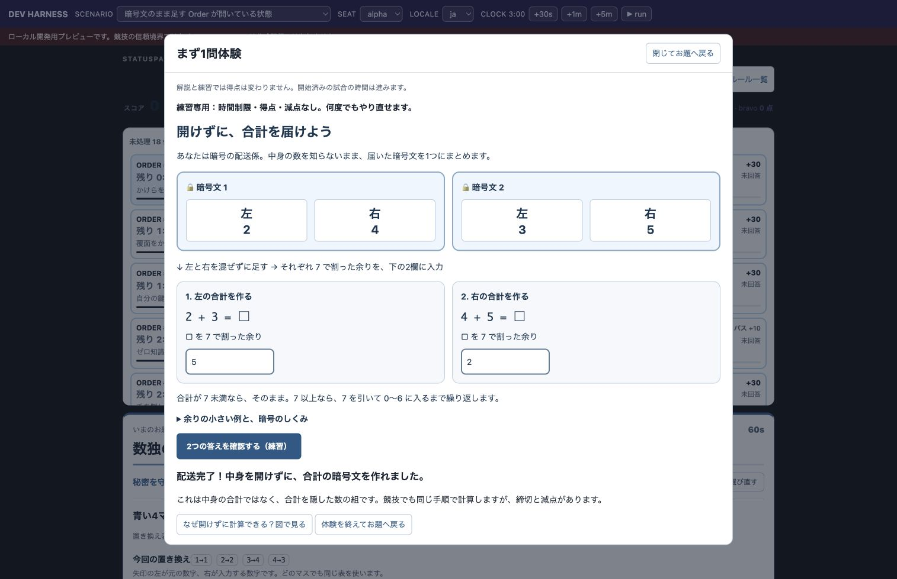

# はじめての暗号配送 / First encrypted delivery

暗号の予備知識は不要です。必要なのは足し算・引き算と割り算の余り。紙とペン、ブラウザを用意してください。プログラミングや AWS の知識は不要です。

No cryptography, programming or AWS prerequisite. Bring paper, a pen and a browser; use addition, subtraction and remainders.

## 体験 / Try it

問題画面の **「まず1問体験」** を押します。左どうし・右どうしを足して2欄に入力し、正解なら配送完了です。練習には時間制限・得点・減点がなく、再挑戦できます。開始済みの本戦の時計は練習中も進むので、開始前に試してください。

Choose **Try your first mission** on the problem page. Add each column separately and submit both remainders. Practice has no deadline, score or penalty, with unlimited retries. An ongoing competition keeps running in the background; practice before it starts.

イベントへの招待がない場合は [ローカルプレビュー](dev/README.md)を使えます。Bun が必要です。自分の端末専用で、認証や公式得点の保存はありません。公開サービスではありません。

Without an invitation, follow the [local preview](dev/README.md). It requires Bun and runs on your own machine, without authentication or official score persistence. This is not a hosted public demo.

画像は練習の固定例です。背景の得点・お題は開発用プレビューで、公式記録ではありません。

## 次の一歩 / Next steps

1. 完了画面から「なぜ開けずに計算できる？図で見る」へ。中身の合計と、その合計を隠した暗号文を比べます。
2. 「一桁の穴埋めで練習」で別の仕組みへ。本戦では締切と減点があります。
3. [問題集](../../README.md)で次の問題を探す。
4. 開催するなら [運営リハーサル](../../challenges/event-host-rehearsal/README.ja.md)へ。参加日程や会場は招待元の運営者に確認してください。ここに募集中イベントの一覧はありません。

After practice, view the diagrams, try another exercise, explore the [catalog](../../README.md), or use the [host rehearsal](../../challenges/event-host-rehearsal/README.md). Ask your organizer about registration and dates.

## 告知文案 / Announcement draft

未投稿。公開する場合は運営者がリンク・開催情報を確認してください。ログインキーや localhost の URL は掲載しません。

> 中学数学で暗号を体験してみませんか？中身を開けずに合計の暗号文を作る「暗号配送」から始められます。紙とペンで1問、次はチームで守る・公開する選択へ。小さい数の教材で、実用暗号の安全性を再現するものではありません。暗号バトルの「1問体験ガイド」へ。

Draft, not posted:

> Try cryptography with school-level arithmetic: combine encrypted packages without opening them. Start with one paper-and-pencil mission, then explore protecting and sharing information as a team. These small-number models are not production cryptography. Follow Cryptography Battle's first-mission guide.

## 聞いてみる / Feedback

- 最初に何をすればよいか分かりましたか？ / Was the first action clear?
- 止まった場所・分からなかった言葉は？ / Where did you get stuck?
- 完了できましたか？何を隠したまま計算できましたか？ / Did you finish? What stayed hidden?
- 次に試したいことは？ / What would you try next?

口頭や匿名メモで確認できます。個人情報の収集や自動追跡は不要です。
