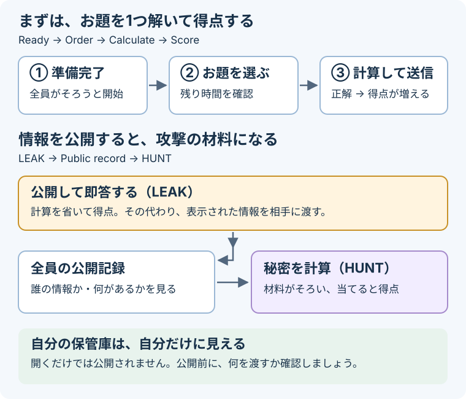

# 暗号バトル

[English](README.md) · [まず1問体験](FIRST-EXPERIENCE.md) · [運営ガイド](OPERATOR.md) · [ローカルプレビュー](dev/README.md)

小さな暗号の問題を手計算で解き、相手が公開した手がかりから秘密を見破るチーム対戦です。計算して得点するか、情報を公開してすぐに得点するか。公開した情報は、相手が攻撃する手がかりにもなります。終了時に得点が高いチームの勝ちです。

用意するものはブラウザ、紙とペン。足し算・引き算・掛け算・割り算の余りから始められ、必要な式と例はお題に表示されます。想定は4人で1チーム。標準設定は **試合90分・同時に最大3問・1問の期限3分** です。

## 開始前に、1問だけ試す

問題画面の **「まず1問体験」** を開きます。2つの暗号の荷物を、中身を開けずにまとめて配送する練習です。時間制限・得点・減点はありません。暗号、プログラミング、AWSの予備知識も不要です。

運営者から案内されたイベントに参加するか、[ローカルプレビュー](dev/README.md)を使ってください。このリポジトリ自体は公開体験サービスではありません。練習は準備完了を押す前がおすすめです。開始済みの本戦の時計は、練習中も進みます。

## お題を1つ解く

1. **「準備完了」** を押す。通常は全チームがそろうと開始します。待機画面には、全員を待たずに始める操作もあります。
2. **お題カード** を選ぶ。やること・残り時間・得点を確認し、同じカードの式と数字で計算します。
3. **答えを入力して送信**。結果と得点を確認し、次のお題へ進みます。

**時間切れは通常−15点。得点の最低値は0点です。** 解説やヒントを読んでいても時計は止まりません。新しいお題は間隔にばらつきを付けて届き、入力中のお題を勝手に切り替えません。未回答が3問ある間は追加を見送り、空きができてから再開します。

画面は **「お題を解く」／「相手を攻撃（HUNT）」** の切り替え、横並び、縦並びを選べます。切り替えても入力は残り、お題一覧で締切を確認できます。

## 計算して答えるか、公開して答えるか

使える操作はお題ごとに異なります。シェアは公開情報の一種で、すべての暗号問題がシェアを扱うわけではありません。

| 操作 | 結果 |
| --- | --- |
| 計算して提出 | 通常+30点。一部は+45点。実際の得点はカードに表示します。 |
| **公開して答える（LEAK）** | 通常+10点。計算せず完了する代わりに、指定された情報が公開されます。公開必須のお題は表示された満額を獲得します。 |
| お題のヒントを開く | 仕組み → 小さい例 → 自分の数字の手順、の3段階。標準の費用は−2・−4・−8点です。 |
| 時間切れ | 通常−15点を1回。未回答のお題から情報が勝手に公開されることはありません。 |

誤答時の扱いは方式によって異なります。入力欄の減点と再提出の説明を確認してください。一部の暗号化のお題では、一度間違えると、その後に計算が正解しても加点されません。無料の解説や自分の保管庫を見るだけでは、減点も情報公開もありません。

## 公開された手がかりでHUNTする

**LEAKで出るのは手がかり。HUNTで答えるのは、そこから計算した秘密です。** 例えばシーザー暗号で「2を暗号化すると5」と分かったら、5−2＝3と計算し、ずらした数である鍵「3」を提出します。公開されている暗号文を写す操作ではありません。

**HUNT** を開き、相手と材料がある方式を選びます。表示された手順で計算してください。方式によって、答えるものが違います。

| 公開されている材料 | HUNTに入力する答え |
| --- | --- |
| 同じチーム・同じ世代の、異なる番号のシェア3個 | 元の秘密 |
| シーザー暗号の元の数と暗号文 | ずらした数（鍵） |
| Vigenèreの3つの鍵位置を覆う公開記録 | 3個の鍵 |
| Rotorの元の数と暗号文 | 2つの車輪の初期位置 |
| RSAの公開値n | nを作った異なる素数2個。LEAKは不要です。 |
| 過去の隠す数の使い回しと、今回の封じた手 | 予測したじゃんけんの手 |

シェアは、秘密を分けて持つための「番号と数」の組です。標準設定では5個のうち異なる番号が3個そろうと元の秘密を戻せます。同じ秘密から作った組を **世代** と呼びます。同じ番号を2回公開しても2個とは数えません。

HUNT画面に、方式ごとの得点・減点・残り回数が表示されます。攻撃成功で相手も減点される場合があり、見破られた側には何を見破られたかの通知が出ます。公開記録と自分の保管庫は必要なときに開けます。現在のプレー画面にはROTATE操作はありません。

## どんな仕組みを体験できる？

新しい試合では、最初のお題の後は方式を混ぜて出題します。RSAなども終盤を待たずに登場します。

- **暗号化・復号**：シーザー、Vigenère、Rotor、エニグマの模型、教科書RSA。
- **隠した数の計算**：秘密分散、数を隠して合計する秘密計算（MPC）、暗号文を開けずに足す準同型暗号。
- **証明と署名**：Schnorrのゼロ知識証明の計算、楕円曲線の足し算、ECDSA署名、SNARK・STARKの検査の一部。
- **ほかの考え方**：同じ働きのプログラムを比べるiO、アナモルフィック暗号の候補選択、手を封じてから開くじゃんけん。

暗号化と復号は別々のお題です。新しいアナモルフィックのお題も、候補選択・復号・確率を独立して完了できます。Schnorrの最初の数の送信と応答は、1回の証明の2段階であり、暗号化と復号ではありません。

小さい数による教材で、実用の暗号強度はありません。何を再現し、何を省いているかは[教材の仕組みと範囲](docs/MODELS.ja.md)にまとめています。保存済みの旧試合には、異なるルールや複数の入力をまとめたお題が残る場合があります。

## じゃんけんと追加要素

手を隠す数で封じた後、対応する手と数を審判に渡します。審判は両者の内容を受理してから公開します。通常は勝ち+30点、引き分け+10点、負け0点。自分に必要な操作を済ませ、相手だけが進行を止めている場合は、期限切れで不戦勝になります。自分の操作が残っている場合は−15点になることがあります。

終盤には、一部のチームへのヒント支援と計算1問の得点を倍にする支援があります。AWSを使う横取りアイテムは初期設定では無効です。設定・制限・費用は[運営ガイド](OPERATOR.md)を参照してください。

## 開催・開発する

| 目的 | 読むもの |
| --- | --- |
| 開催までの日程、役割、準備を考える | [イベント運営リハーサル](../../challenges/event-host-rehearsal/README.ja.md) |
| 回答時間、採点、更新、片付けを確認する | [運営ガイド](OPERATOR.md) |
| 実際のゲーム部品をローカルで動かす | [開発プレビュー](dev/README.md) |
| 暗号の仕組みと教材の範囲を知る | [教材ガイド](docs/MODELS.ja.md) |
| 問題の定義を見る | [metadata.json](metadata.json) |

進行と採点はTenkaCloudの既存の連携サービスで処理し、チームごとのゲームサーバーは作りません。ローカルプレビューはメモリ上の状態と仮の認証で動き、公式得点の保存・実AWS権限・デプロイ先の動作を検証するものではありません。作成するリソース、片付け、検証の範囲は運営ガイドに記載しています。
