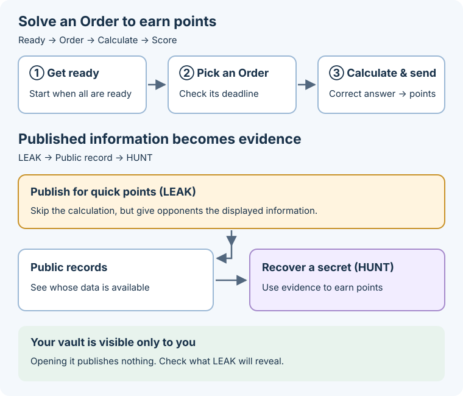

# Cryptography Battle

New here? [Try one paper-and-pencil mission](FIRST-EXPERIENCE.md), with no cryptography prerequisite. **Try your first mission** on the problem page has no deadline, points or penalties. Competition Orders have deadlines and penalties.

A timed team game of small, hand-calculated cryptography problems. Orders keep arriving at varying intervals; each new-match Order allows **3 minutes**. Decide what to solve, when to disclose information for an instant answer, and when to use an opponent's public evidence. The highest final score wins.

**Correct answers earn points; missing an Order deadline deducts points (normally −15, with a zero floor).** The remaining time on each card is the submission deadline. Reading explanations does not pause it.



Five optional entries appear above the game: “Try your first mission”, “How to play”, “Cryptography in diagrams and formulas”, “One-digit practice”, and “Rules reference”. They open on a separate scroll surface. Closing returns to the original Order, unfinished answer and page position. An ongoing match keeps running. Practice connects remainders, sharing, reconstruction, publication risk, MPC, ZK, FHE, Caesar and commit-reveal with small numbers. Reading without answering is allowed.
Guided scenes first show a short instruction, calculation and one hole. Steps and reasons are available in a collapsed explanation; answer feedback is one sentence.

The focused workspace groups the current Order, answer methods, scores, disclosure costs and inputs. MPC shows received-mask total, sent-mask total, the expression using the player's input and the remainder step with actual numbers. Results appear above the answer area. Hints and exposure details expand on demand. “Open public records and my vault” opens the public history and private vault in a separate dialog; close it to return to the mounted answer form. Detailed match data lives inside “Rules reference”, outside the timed workspace.

The Order list stays visible while answering, with the pending count, task, deadline and selection. Cards appear in deadline order and can be selected directly by click or Tab and Enter / Space. New Orders receive a short arrival notice and a New badge without changing the selected Order or unfinished input. Due soon, Expired and Completed also appear as text. Recent results remain below the list, including earned points for answers confirmed in this screen. Narrow screens and larger queues scroll within the list.

“Cryptography in diagrams and formulas” explanations cover remainders, secret shares, MPC, ZK, FHE, and Caesar shifts in four or five steps: purpose, mechanism, a one-digit worked example, and the live inputs. Each calculation form also opens its relevant explanation locally; the last step copies the current Order’s operands into an unsolved expression. Reading never changes scores or match state and can be closed at any step.

HUNT starts with an **opponent dropdown**, showing team name, ID, score and whether evidence is available. Available opponents come first; the optional evidence filter narrows the list. Choose a method for that opponent, inspect its public evidence, then hand-calculate and submit. Original and encrypted Caesar rows align vertically so the same positions can be compared. New evidence keeps the selected opponent stable while that opponent still matches the filter. ROTATE remains a separate defence control.

A share attack uses distinct indices from one generation. Vigenère needs all three key positions, RSA uses public n/e, and RPS predicts a hand from past openings. The reused-sudoku worksheet belongs only to saved legacy matches; new matches use Schnorr.

## What is going on

Solve Orders for points and compete for the highest final total. Each Order shows its inputs, accepted methods, points and deadline. Orders requesting a share or encryption also offer an instant answer that publishes information.

A share is an index-and-value pair used in secret sharing. This game creates five shares of a secret; three distinct shares from one generation reconstruct it. Two alone cannot identify it. A generation groups shares made from the same secret.

## The moves

| | What it does | What it costs |
| --- | --- | --- |
| **LEAK** | Publish a share, or an original/encrypted pair, to answer instantly | Public records can supply an opponent's attack |
| **PROVE** | Commit a, receive e, and hand-calculate the Schnorr response z | Requires calculation; wrong submissions cost points |
| **HUNT** | Recover a secret, key or hand from public information and attack | Secret, sudoku and hand misses cost points and attempts; an incorrect cipher key is rejected without a charge |
| **ROTATE** | Replace the secret and key with a new generation | Unanswered secret-bound Orders become void and cost points; after a mandatory disclosure, pay at least one expiry penalty (the larger penalty only; score never falls below zero). Rock-paper-scissors continues |
| **HINT** | Open one more step of how to solve the Order you have selected | Costs points — and they do not come back if you never solve it |

An ordinary correct calculation earns +30, LEAK earns +10, and expiry costs −15. Check each card for its accepted methods and actual points.

## Cryptographic techniques and the calculation taught here

| Order | Technique | Part explored in this model |
| --- | --- | --- |
| add without decrypting | **Homomorphic encryption** | How ciphertext addition relates to the decrypted result |
| masked subtotal | **Secure computation (MPC)** | Adding masks to private inputs and cancelling them in the total |
| PROVE | **Zero-knowledge proofs (ZK)** | Schnorr public verification, simulation and knowledge extraction |

New matches use a tiny-parameter Schnorr calculation model, not secure authentication: the browser keeps x and r private and submits y and the conversation (a,e,z). Saved legacy matches retain the sudoku teaching model, whose trusted judge knows the original solution. FHE supports computations built from addition and multiplication. This Order explores addition using small numbers. The diagram-and-formula explanations describe the difference from practical systems.

## Goal

Score by solving the incoming Orders while managing what you reveal. **Shares are one kind of evidence, not the rule for every cryptographic task.** A leaked cipher pair, a public RSA key and a secret-sharing share support different calculations. The selected HUNT method explains what it needs. ROTATE changes the generation but also costs points; inspect its effect before using it.

## Orders keep arriving

New matches start with one Order and then receive more at varying intervals. The participant instructions do not disclose the arrival interval. Both ordinary and rush Orders expire after 180 seconds. Existing matches retain their stored settings. Choose which calculations, disclosures and attacks to attempt before their deadlines.

## ORDER types

| What the card asks for | What you do |
| --- | --- |
| reveal a share | choose LEAK or PROVE |
| publish a share (publication required) | LEAK only, full points; a new index adds one distinct public share, a duplicate adds zero. ROTATE first to avoid publishing |
| show it without showing it | PROVE: commit a and calculate the response z to the verifier challenge e |
| encrypt with your key | shift each symbol forward by your key (CIPHER), or LEAK |
| encrypted addition | add both pairs component by component, remainder p |
| masked subtotal | compute my number + received masks - sent masks, remainder p |

Every card shows its deadline, points, task, and accepted methods. A method absent from the card cannot perform the task or violates its disclosure condition.

## Moves

| Move | Meaning |
| --- | --- |
| LEAK | let the system answer the ORDER. What becomes public depends on the ORDER |
| PROVE | publish Schnorr y and (a,e,z); neither x, r nor a share is sent |
| CIPHER | encrypt the symbols with your key and submit. Nothing is published |
| FHE | add ciphertexts without decrypting |
| MPC | submit one subtotal while each office's input stays private |
| HUNT | submit a secret, a sudoku solution recovered from a reused relabelling, or a cipher key recovered from public records |
| ROTATE | replace your secret and shares with a fresh generation |
| HINT | open the next step of the selected ORDER's hint ladder. Nothing is published |

## Stuck? — HINT

Hints progress through mechanism, a small example, and your own values. Schnorr hint 3 uses the current values in separate steps: multiply, add, find the remainder after division by 11, then enter z. Before sending a, it shows the steps for a instead. Results are not filled automatically; players calculate by hand.

Each one costs points, and they get more expensive as you climb (**-2 / -4 /
-8**). The price is printed on the button, so you compare before you press.

For a +30 calculation with −2/−4/−8 hints, solving after all three leaves +16 before other score changes, compared with a +10 LEAK. Actual rewards and support vary by Order. But
the charge does not come back if you never answer — the worst hint to buy is one
on an Order you were going to abandon.

Hints never reach the public record. Nobody can see that you bought one.

## The cipher ladder

Normal cipher Orders progress from Caesar to alternating Vigenère/Rotor and then RSA. These are different calculations, not a ranking of security.

| Method | Evidence used in the game |
| --- | --- |
| Caesar | One original/encrypted pair |
| Vigenère | All three key positions |
| Rotor | Public rows that constrain the initial wheel positions |
| RSA | The public modulus n; no LEAK required |

The method is printed on the Order. That is deliberate, and it is how real
cryptography works: the algorithm is public. Classical rungs keep their shift
keys private; RSA publishes its encryption key while keeping a recovery key
private. Keeping an answer private is not a security guarantee for these tiny models.

LEAK publishes the symbols **next to** their encrypted form. On the Caesar rung
that single pair is the key. Vigenère records identify the disclosed key positions. Rotor records let the
reader test initial positions; a single pair may leave several possibilities.
RSA attacks use the public n and do not require a pair.

ROTATE moves the key to a new generation. Attack submissions must name the
current generation and use its public information. Tiny RSA keys may recur;
rotation does not guarantee that earlier factors stop matching the new n.

The complete Portal reference contains the formulas, constants, and runnable Python for PROVE and HUNT. New-match PROVE uses the Schnorr protocol below; share reconstruction uses Shamir threshold sharing (distinct from the additive sharing exercise in `ac26-w2-secret-sharing`).

## Reading the screen

Press “I'M READY”. The match starts and Orders arrive when every team is ready.

1. **Current Order** — the request and its remaining time
2. **Answer methods and inputs** — compare score and disclosure cost, then answer in the same card
3. **Result** — score and outcome above the answer area
4. **HUNT** — select an opponent from the dropdown, then a method
5. **Open public records and my vault** — optional public history and private vault in a dialog
6. **Try your first mission, how to play, diagrams and formulas, practice, rules** — choose one purpose above the board

HUNT shows the selected opponent’s public evidence and attack status. A ready method opens its worksheet, with formulas, diagrams and public values for the player to calculate and submit an answer. ROTATE is a separate defence control.

## Data boundary

- The match secret and complete match state stay on TenkaCloud's trusted side.
- The browser receives only `projectForTeam` output.
- A team's vault and Orders are visible only to that team.
- Opponent secrets, un-leaked shares, and the match secret are never projected.
- The Public Ledger contains only artifacts participants chose to publish.

Production hidden values derive from the server-only `matchSecret`, never the public `eventId`. Local-only runs use the explicit non-secret marker `local-play-not-secret:<eventId>`.

## Operator pacing configuration

`STREAMING_ORDER_CONFIG` uses a 30-second base interval with up to 10 seconds of variation in either direction, and a 180-second deadline for ordinary and rush Orders. All teams share the same seeded schedule. Reloads and delayed ticks do not reroll it. Each team has at most three unanswered Orders, including duels. A full queue skips new arrivals without an expiry penalty; after a slot opens, delivery resumes at the next scheduled arrival. Duel Orders are delivered only when both teams have room. Skipped arrivals do not build up into a later burst. Saved matches keep their stored configuration; deploying this change does not reset their clock or extend existing deadlines.

## Local UI check

```bash
cd battles/ac26-crypto-battle/dev
bun install --frozen-lockfile
bun test
bun run typecheck
bun run dev                 # http://localhost:5644
```

The harness uses the real reducer and Portal components but fake authentication and persistence. It is useful for UI checks, not evidence of tenant isolation or real AWS E2E.

Game checks:

```bash
cd ../game
bun install --frozen-lockfile
bun test
bun run typecheck
```

## Completion boundary

The release gate is the game/dev test and typecheck suites plus the browser harness running the real Portal components. The harness checks the first move, interaction, and result using participant-visible inputs only. A real-AWS walkthrough and an independent third-party playtest are optional pre-event rehearsals; not running them does not block development or merge.

## Files

- `game/src/reducer.ts` — rules, validation, team projection
- `game/src/types.ts` — state / op / projection
- `coordination/crypto-battle.ts` — platform adapter
- `portal/` — participant UI
- `dev/` — local UI harness
- `OPERATOR.md` — current operating boundary and checks

## Seal a hand, then play rock-paper-scissors

Choose hand m (1=rock, 2=scissors, 3=paper) and draw a fresh hiding number r
uniformly from 0–10, including zero. Write both down. Read the remainders of 4^m and 9^r after division by 23 from the
free on-screen tables, multiply, and enter the **remainder after division by 23**
in Sealed number. For m=1, r=1: 4×9=36; 36−23=13.

After sealing your number, submit m and r privately using Give my opening to the judge,
without waiting for the opponent. Acceptance completes your actions; opponent delay cannot penalize you.
The judge verifies and publishes both openings together. Win +30, draw +10,
loss 0. A mismatched opening can be corrected without a penalty; accepted
commitments and openings cannot be replaced. Work on another Order while waiting.
At the deadline, finishing your required stage earns a forfeit win; an outstanding
required action gets the ordinary expiry penalty. ROTATE does not cancel a duel.

This is a commit-reveal teaching model. Tiny numbers permit alternative openings;
it has no practical binding security. Fairness trusts the judge to withhold both
openings until simultaneous publication. Commit-reveal is not itself a
zero-knowledge proof. Free stepwise explanations and optional fill-in practice
connect the calculation to its purpose.

## Predict an opponent's sealed hand

This tactic becomes available when two different past public rounds show the same
hiding number r. The current RPS answer area shows an optional prediction form beside
your opening control, with those public records, the current sealed c and calculation tables. Assume the same r again,
calculate c for rock, scissors and paper, and submit the matching hand to the judge.
Past repetition does not guarantee the same r in this round. Drawing r uniformly
with replacement can repeat a value by chance. If both hand and r are chosen
independently and uniformly each round, matching a candidate still has only a one-in-three hit rate.

Example: for r=1 the table gives 9. Rock gives 4×9=36→13, scissors
16×9=144→6, and paper 18×9=162→1, taking remainders after division by 23.
For c=6, predict scissors.

Submit once per duel before both hands become public, including while the judge
privately holds only the opponent's opening. You can predict, then give your own
opening; prediction is optional. No held hand or r is shown. Predictions are immutable and private.
After both hands become public, a hit earns 25 points and a miss costs 8 (score floor 0).
The three-attempt limit per opponent generation is shared with share-recovery HUNT.
A timeout without publication cancels the prediction and refunds its attempt.
ROTATE keeps the public RPS history and already submitted predictions.

Confirmed scored Order answers show a short celebration, earned points and the current total; the result remains after the animation ends. Reduced-motion preferences suppress the animation. Incorrect PROVE answers show the penalty. Renaming diagrams connect the selected table to the two sudoku grids; optional concept diagrams distinguish the ZK concept from this trusted-judge teaching model.

### Score history integration

The plugin reports fixed public reason codes for PROVE, CIPHER, LEAK, FHE, MPC, DUEL, HUNT, hints, ROTATE and deadlines. These contain no answers or secrets. With the TenkaCloud #3194 host fix, Score events shows the actual change after applying the zero-point floor. Previously missing history is not reconstructed.

### Endgame hint support (#659 booster)

At the endgame boundary, every team tied for last receives ten minutes without hint penalties. Solo practice does not qualify. The support activates immediately on distribution: later rankings, reloads and ROTATE do not change its recipients or deadline. Defaults distribute it 60 minutes after match start and restore regular penalties at minute 70; an earlier match end also ends the support.

Check “No hint penalty” and its remaining time beside the selected Order's hints, then open a hint and continue the calculation. Order deadlines, issuance and answer scores stay unchanged. If a request arrives after the displayed penalty changes, the hint remains closed and the participant is asked to refresh before opening it.

A legacy match upgraded after the endgame boundary has no saved ranking for that instant. It retains regular hint penalties and displays the reason instead of inventing a past distribution. Higher cipher rungs remain separate increments. Lightning is described below.

## Cipher ladder: Caesar, Vigenère, Rotor and textbook RSA

The method changes for newly issued cipher Orders when the existing `pressure`
phase begins (30 minutes after match start by default). Orders already issued
keep their method and deadline. Build uses Caesar's single shift;
normal pressure cipher slots alternate a three-shift Vigenère cycle and Rotor.
Normal endgame cipher slots use RSA;
rush cipher slots retain Vigenère. Read the highlighted key position,
add that private shift to the original value, take the remainder after dividing
by 6, and submit the one value with **CIPHER**. Its answer stays private to the
trusted judge; this is not a zero-knowledge proof.

Vigenère repeats keys 1 → 2 → 3 → 1. Each Order here is one position from that
cycle. LEAK publishes the original, answer and key position. Three *distinct*
positions reveal all keys; three copies of one position do not. The server requires all three positions from that target, rung and generation.
The attack panel reports the covered positions and accepts keys 1, 2, 3 separated by spaces.
A single long known plaintext/ciphertext pair spanning all three positions
would already reveal all keys. This classical repeated-key cipher is not a
modern secure encryption scheme.

A first correct CIPHER keeps the Order's normal score (30 for standard Orders;
existing rush settings still apply). A well-formed wrong Vigenère, Rotor or RSA answer costs
`wrongProve` (6 by default) and permanently forfeits that Order's CIPHER reward.
Correct retries complete it for 0, avoiding expiry; malformed inputs do not count.
The screen states both outcomes before submission. LEAK still pays 10, Vigenère HUNT pays 25 with a 12-point victim
penalty subject to the score floor. Caesar retains its existing 8-point HUNT
reward. ROTATE retires old-generation evidence, while the public records remain.
These changes add no AWS resources, settings, timers or cleanup obligations.

Local verification: `cd game && bun test && bun run typecheck`; `cd dev && bun test
&& bun run typecheck`. The `vigenere` dev scenario uses the standard five-minute
TTL and three actual opponent LEAKs. See [the recorded local walkthrough](dev/VIGENERE-READING.md).
RSA is implemented in standard endgame Orders and public-key HUNT.
Rotor is the two-wheel teaching exercise described below. Existing Shamir, encrypted
addition and endgame assistance remain available; no additional FHE Order is introduced.


### Endgame lightning (#659 §9)

At the existing endgame boundary, the bottom two teams receive one card each,
including ties at the second-lowest team's score. Two-team matches award only
last place (both if tied); solo practice awards none. Allocation is fixed once,
using the same boundary snapshot as the hint booster, and survives reload/rank
changes. The card and its selected Order are private to the receiving team.

Choose an unanswered calculation Order, then declare lightning before submitting
an answer. A correct PROVE, CIPHER, FHE or MPC pays twice that Order's existing
reward, including a rush reward. #659's broad PROVE means doing the calculation;
DUEL win/draw/forfeit points are not calculation-answer rewards and do not qualify.
No new score constants or timers are introduced. The card is fixed to one Order,
with no undo or stacking. A rejected input does not create an accepted-answer
record. A recorded PROVE miss or Vigenère/Rotor/RSA cipher failure prevents later declaration.

After declaration, wrong answers may be retried on the same Order until its
existing deadline. Existing penalties remain unchanged. Vigenère, Rotor and RSA forfeit their
base reward after a wrong answer, so its doubled reward is also zero; correct
completion still avoids expiry. LEAK pays its ordinary reward and spends the
card. Deadline, ROTATE or match end expires it without multiplying any penalty.
The UI states target, resulting reward and remaining time together and links
back to the declared Order when another is selected.

Schema 9 adds allocation/target/result state and accepted-answer history. Older
matches already past the boundary report unavailable allocation rather than
invent a historical rank. Older open Orders have unknown answer history and
cannot receive a card; new Orders can. Existing schema-8 Vigenère failure flags,
compact HUNT/RPS reservations and hint booster decisions are preserved.

Local evidence: `game/src/lightning.test.ts` uses the real reducer/host and Portal
component; the `lightning` dev scenario reaches minute 61 through normal ticks
and opponent calculations. Run game/dev tests and typechecks, then the repository
catalog gate. See [the local walkthrough](dev/LIGHTNING-PLAYTHROUGH.md).


### RSA: one public-key encryption exercise

At the existing endgame boundary (default minute 60), newly scheduled **normal**
cipher slots become `rsa-encrypt`: original integer m=2…9, public n≤77 and
exponent e=3, 5 or 7. Existing Orders keep their task and deadline; delayed ticks
use the scheduled issue time. In new matches, normal RSA Orders allow 180 seconds and award 30
points. Rush Vigenère Orders allow 180 seconds and award 45 points.

Calculate `c=m^e mod n` (multiply e copies of m and take the remainder after
division by n). Intermediate remainders preserve the result. **CIPHER** submits
one integer privately to the trusted judge; it is not ZK or proof of a private
key. **LEAK** publishes m/c and the already-public n/e for 10 points. Neither
operation publishes the factors or recovery exponent. A well-formed wrong
answer costs 6 and makes all later CIPHER success on that Order worth 0, also
with lightning. A clean declared calculation earns the existing 60 points.

**RSA HUNT** uses an opponent's current public n/e, even with zero LEAK records.
Enter two distinct prime factors of n in either order: success +25, victim −12
with the existing zero floor. Incorrect factors are rejected without a deduction
or attempt cap; one success is accepted per attacker/target/generation. A prime
is an integer at least 2 divisible only by 1 and itself. Factoring n reveals how
to calculate a recovery key; the optional explanation connects φ, d and
`m=c^d mod n` with n=33/e=3. The judge checks factors, not equality to one d.

**日本語:** 終盤の通常の暗号お題はRSAです。元の数mをe回掛けてnで割った余りを、
CIPHER欄へ1個入力します。公開鍵n/eは全員に見え、元に戻す鍵は隠します。
LEAKは元mと答えcを公開します。HUNTはLEAK不要で、相手のnを異なる素数2個の積に
分けて提出。素数が分かれば元に戻す鍵を計算できます。誤答後のCIPHERは0点で
再挑戦し、正しく完了すれば失効を避けられます。初回正答30点、宣言済みなら60点、
LEAK10点、HUNT+25/被害−12点です。数が小さく、同じmから同じcが出る教材なので、
Vigenèreより常に安全という意味ではありません。ROTATEで同じnが再登場する場合もあります。

Public/private-key roles follow the seminar's [Week 5 slides 3–4](https://acp26-week5-presentation-agent.zk-tokyo-japan.workers.dev/3)
and the participant's `advanced-cryptography-note/week5/index.html` (slides 3–4).
[Week 1 notes](https://github.com/susumutomita/advanced-cryptography-note/blob/main/week1/index.html)
distinguish textbook RSA's multiplication property from full FHE. This increment
adds no multiplication/FHE task. Mathematical conditions and encryption primitives
follow [RFC 8017 §§3 and 5](https://www.rfc-editor.org/rfc/rfc8017.html#section-3.1).
Practical RSA needs large keys and an appropriate randomized encoding scheme;
this tiny deterministic model provides no modern encryption-security guarantee.

See [the recorded local RSA walkthrough](dev/RSA-READING.md) for a participant-only
maximum-range packet, independent AI arithmetic and actual Portal submissions.
Schema 11 retains schema-10 RSA records, lightning and cipher failures. The existing
`homomorphic-sum` Order already teaches addition on hidden inputs in every phase;
it is an addition-only model, not full FHE or an assertion that later rungs are unbreakable.

### Rotor: trace two moving wheels

Normal pressure cipher slots alternate Vigenère/Rotor. A Rotor Order has four
numeric cards 0–3, public P=[1,3,0,2] and Q=[3,0,2,1], and initial positions a,b
visible only to its owner and the judge. The on-card formula is
`u=(P[(m+a) mod 4]−a) mod 4`, `c=(Q[(u+b) mod 4]−b) mod 4`.
Here mod4 means remainder after division by4 (add4 if negative), m is original,
u intermediate and c output. Output first, then advance a; only a's3→0 carry
advances b, which also wraps3→0. A separate one-digit example and a four-row
worksheet sit by the input. This changes the replacement table with position,
rather than adding three repeated shifts.

Each Order in a generation restarts from the same initial positions. CIPHER sends
four outputs privately (+30); LEAK publishes the original/output pair (+10).
One pair can determine the initial positions, or leave multiple candidates. HUNT
requires one current-generation Rotor pair and the true initial a,b, not a forced
second LEAK or a client-side uniqueness claim. A miss costs8 and an attempt from
the existing shared Shamir/RPS budget (3); Sudoku's separate budget is unchanged.
Success gives25, costs the victim12 (floor0), and is recorded once in replay.
Wrong CIPHER uses the existing6-point penalty and forfeits that Order's subsequent
reward, including lightning. New matches use the 180-second deadline and varying Order arrivals;
endgame RSA and rush Vigenère remain. ROTATE voids old Orders and attack
eligibility; the tiny16-state key space can repeat numeric initial positions.

This is a small reversible model, not actual Enigma and not a security ranking.
It borrows position-adjusted wiring from the [NSA educational simulator](https://github.com/NationalSecurityAgency/enigma-simulator/blob/master/components.py).
The reviewed seminar and owner notes contain no direct Rotor exercise; their
connection is encryption/recovery keys and checking the exact conditions under
which reused secrets leak. See [the Rotor reader and runtime record](dev/ROTOR-READING.md).
No new resources, services, IAM, timers, score prices or cleanup steps are added.

### Answer workspace (#780)

New Caesar orders contain three symbols. The answer field explicitly requests space-separated numbers. Legacy-match Sudoku PROVE prepares a private random unused relabeling and immediately shows four marked inputs; clock updates and identical poll responses retain the relabeling. This remains the trusted-judge teaching model, not a full ZK protocol. MPC includes a three-party mask-cancellation diagram and its general equation; duel powers use superscripts and expanded products.

### HUNT opponent selection (#782)

The HUNT dropdown lists every opponent, prioritizes those with public evidence, and supports an evidence-only filter. All opponents remain selectable in a 100-team match. Select a team and method to see one worksheet. New evidence does not replace the selected worksheet. Successful attacks disable that method for the current generation; ROTATE remains a separate defense action.

## When an opponent recovers your secret

A notice above the answer workspace identifies the attacker, secret type, generation and actual score loss. Draft input stays intact. Review defense opens the ROTATE impact before committing that action. After rotation, the notice is labeled as a previous-generation event. Only the latest notice is retained; polling does not replay it. Old history is not backfilled with guessed penalties.

### New-match Schnorr zero-knowledge proof (#783)

Based on Week 3 lecture slides 54–60 and the learning note's Schnorr section.
The browser keeps witness x and fresh randomness r. It sends public y = 2ˣ mod23 and hand-calculated a = 2ʳ mod23. After these are fixed, the verifier returns e from 0–10. The player hand-calculates z = (r + ex) mod11. Verification checks **2ᶻ ≡ a yᵉ (mod23)** using public values only; x and r never reach the server.

A commitment cannot be replaced and each challenge accepts one response, including a wrong response. Foreign Orders, expired responses and duplicate rewards are rejected. Private values are retained in session storage: continue in the original tab.

The four-stage mathematical guide covers a worked example, exponent laws, an identical-distribution simulator without x, and extraction from two responses to the same a. This is honest-verifier ZK (HVZK). At most 11 secret candidates exist, so this model provides no practical authentication security. Successful verification is not secret recovery and does not award HUNT points.

The statement is knowledge of the discrete logarithm x for y, not knowledge of a secret-sharing share or Sudoku solution. Persisted legacy matches retain the trusted-judge Sudoku model; new matches select Schnorr through the versioned configuration.

The server assigns y per Order; a caller cannot replace it. In this tiny-group teaching model the browser finds x from a power table. This is not practical secret-key provisioning. The verification function accepts public values only; responses contain neither x nor r.

## Elliptic-curve point addition (#784)
Legacy settings offer EC addition at every thirteenth sequence slot, with duels taking priority. Calculate addition, doubling and the identity O on y²=x³+2x+3 modulo7. This is foundational arithmetic used by ECDSA, not a complete signature scheme. Submit `x y` separated by one space, or `O`. The worksheet contains equations, an inverse table and a coordinate plot. Wrong answers use the existing wrongProve penalty; correct answers receive the Order reward. Existing expiry, ownership and replay gates apply. Legacy matches do not enable these Orders. No platform changes.
Verify with `cd game && bun test src/ec.test.ts && bun run typecheck`, then the dev `ec-order` scenario.

### Hand-calculated SNARK arithmetization (#791)

Legacy settings insert a gate/copy worksheet on every seventeenth candidate slot while retaining duel slots. It presents addition, multiplication and addition gates plus two required wires. Players enter five residuals modulo7, detecting a valid table, a corrupt output, or locally valid gates with incorrect wiring. Correct detection of nonzero residuals earns points. Existing ownership, deadline and replay gates apply; the score reason is `snark`.

Inputs: lecture repository revision `bdbc913fa7fd4ed87ce7f0de6b1d73fb41e49732`, Week3 zkSNARK and Week4 slides25–29; study-note revision `58344a29ea39c25839475ba9a594c115ed89989b`, `week4/index.html`, PLONK gate table and grand product. This extracts the gate equation and copy constraints. Polynomial interpolation, KZG commitments, evaluation proofs, the copy grand product, succinct noninteractive proofs and zero-knowledge masking are not implemented. It is a visible arithmetization worksheet, not a complete SNARK.

`snark.test.ts` covers correct and corrupt gates/wires, incorrect-answer penalties, rewards, replay, expiry and foreign ownership. In the real local Portal scenario `snark-order`, hand-calculated residuals for `4+5−2, 4×1−5, 4+3−6, 2−4, 5−3` were submitted as `0 6 1 5 2`; the UI reported incorrect wiring detected and +30 points.

PR #790 follow-up: accepting a Schnorr commitment starts the answer attempt, so lightning must be declared beforehand. A failed one-shot PROVE-only Order is resolved with a persisted miss, without a second deadline charge or further paid hints. Orders permitting LEAK retain that alternative. Optional practice uses the current Schnorr exchange in both languages.

### Score and mandatory-disclosure regressions (#777 / #778)

`streaming-orders.test.ts` isolates expiry penalties over 30 minutes and verifies that pruning completed Orders does not remove earned points. `disclosure-score-regression.test.ts` uses normal penalties to verify a missed deadline deducts once while completed history survives. Scores are cumulative team state, not a sum over visible Orders.

`score-polling-regression.test.ts` checks both teams every five seconds for 15 minutes: reading projections never opens hints, and each waiting-period deduction matches newly expired own Orders. Explicit hint purchases deduct only from their owner. The score header shows the stored match's per-Order deadline penalty and zero floor; waiting does not pause deadlines. The historical #777 sequence was traced to a concurrent test agent buying three hints for the same team: saved operation responses show 28, 24, then 16 points, followed by deadline penalties. The regression reproduces 30 → 28 → 24 → 16 → 1 → 0 with those explicit operations and deadlines.

The earlier run covered 90 minutes with the then-current 30-second arrival / 60-second deadline, Schnorr and EC configuration. Both teams LEAK only mandatory-disclosure Orders and successfully HUNT using only participant-projected public shares. No voluntary disclosure is required. The originally reported deployed revision is unidentified; this evidence exercises the local production reducer/projection. Verify the deployed environment after the owner deploys.

### Finite iO definition worksheet (#793)

Legacy settings offer an iO worksheet on every nineteenth candidate slot, subject to existing EC and duel slot priorities. Two straight-line programs each contain three arithmetic operations modulo 5. The entire input domain is 0,1,2,3. Participants fill two outputs, test equivalence on all inputs, and count shared full encodings in two displayed distributions. Correct answers use the existing problem-owned submission gate, expiry, replay prevention and Lightning; the score reason is `io`.

Source basis: Barak et al., *On the (Im)possibility of Obfuscating Programs* (CRYPTO 2001), https://www.boazbarak.org/papers/obfuscate ; Jain, Lin and Sahai, *Indistinguishability Obfuscation from Well-Founded Assumptions*, https://doi.org/10.1145/3785007 . The definition compares equal-size, functionally equivalent circuits, requires correctness and computational indistinguishability, and includes efficiency. Here size means three operations in a tiny arithmetic language, not the bit-gate size of general Boolean circuits.

The model enumerates the complete truth table, discards source syntax, and publishes a uniformly chosen rotation plus its public offset. Evaluation at x reads cell (x+r) mod 4. All four representations preserve the function. Equal tables with identical rotation choices yield exactly equal distributions. Orders also include flawed source-dependent rotation choices: equivalent programs can share zero through four outcomes, so the final comparison is not determined by equivalence. Each candidate still preserves the function. Unequal rotation probabilities can reveal the source; shared-support count alone does not establish indistinguishability. Appending a source label would destroy that property. Different functions are outside iO's indistinguishability promise. No encryption or claim to conceal the function is made. For k input bits, enumeration requires 2^k rows: this is **not an efficient general-purpose iO construction**, nor an implementation of the cited papers' cryptographic constructions.

Validation: exhaustive correctness for 625 tables and all four rotations, changed-input distribution checks, generated equivalent/inequivalent tasks, wrong/correct score deltas, Lightning, foreign ownership, replay and expiry. Local real-Portal `io-order` play showed A=2x, B=2(x+3)+1; outputs 4 and 3, equivalence 0 and overlap 0 were submitted and +30 plus success feedback appeared. Combined with SNARK #797: 758 ordinary regression tests passed; 79 dev tests and both typechecks passed. Schema 17 preserves old configuration rather than adding iO to in-progress matches. No deployment performed.

The additional distribution regression enumerates all 225 nonempty rotation-support pairs, including equal functions with partially overlapping outputs. A fresh real-Portal `io-order` pass on the candidate-randomness implementation displayed A rotations [0,2] and B rotations [0,1]; submitting 4,3,0,0 again produced success and +30.

### STARK trace, AIR and one fold (#792)

Legacy settings add a STARK candidate every 23 slots, subject to the other explicit special-slot priorities. The participant checks two transitions of repeated squaring over F7, computes the constant of the remainder polynomial, then the constant of one FRI fold. Each of the four fields has its formula and worked example beside it; explanations and scoring feedback are available in Japanese and English. Existing match settings do not acquire the new task. Schema 18 protects readers which cannot understand STARK Orders.

The three trace values are interpolated at 1,2,4. C(X)=T(2X)-T(X)^2 is divided by (X-1)(X-2), excluding the last-to-first transition. Both transition checks vanish exactly when the polynomial remainder vanishes. A quotient of degree at most two folds into a polynomial of degree at most one. A correct fold does not establish a correct trace; the exercise explicitly separates these checks.

Inputs: Advanced Cryptography 2026 Week4 slides20–23 (PDF pages24–27), revision bdbc913fa7fd4ed87ce7f0de6b1d73fb41e49732, and the Week4 personal note at revision58344a29ea39c25839475ba9a594c115ed89989b. This adapts the lecture’s trace/AIR/quotient/fold chain to single-digit parameters. It does not implement Merkle commitments, verifier random queries, repeated FRI rounds or zero-knowledge masking, and is not a complete STARK.

Validation: all343 traces satisfy interpolation and quotient/remainder identities; all nonzero query pairs and challenges satisfy the one-fold equation. Owned-order tests cover wrong/correct scores, Lightning, replay, expiry, foreign teams and malformed projection rejection. Ordinary regression:764 tests; dev harness:82 tests; types and catalog:pass. In the real local Portal `stark-order`, trace6→6→5, Q=4+3X+6X², β=6 gave submitted5 4 6 1, success feedback and score30. Production deployment not run; deployment remains with the user.

### Issue #780 — Labels follow the actual proof protocol

The Order belt, recent receipts, and status labels use the projected protocol: Schnorr responses, the legacy Sudoku model, or required share publication. A local real-component walkthrough calculated a=3 and z=4 from the displayed inputs and observed proof success, +30 points, and verification 16=16. This verifies local UI behavior, not production score persistence.

### Anamorphic rejection sampling (#794)

Based on Persiano–Phan–Yung, EUROCRYPT2022, section5.1: https://iacr.org/archive/eurocrypt2022/132760134/132760134.pdf . This is the rejection-sampling route, not the appended-payload approach the paper rejects. Separate Orders ask the participant to select a normal ciphertext matching the intended secret bit, decrypt with the ordinary key, or count accepted tickets in a biased distribution. The role diagram distinguishes sender, monitor and receiver. The final field sums accepted tickets, rather than transcribing a lookup bit. A biased-draw counterexample shows1/4 differs from the ordinary2/7 probability. Each new Order has one answer field, with bilingual formulas, a small worked example and pre-submit deduction. Persisted combined worksheets keep their original three fields and explanatory examples.

The arithmetic uses ElGamal-shaped pairs modulo7. A balanced six-entry table substitutes for a pseudorandom function (PRF); it is scoped to one ordinary message. Neither the tiny group nor the lookup is practically secure. For each hidden bit, averaging uniform accepted-candidate selection across all20 balanced secret tables gives the ordinary1/6 distribution for a single packet. No multi-message security claim follows. Repeated trials in the paper are independent; the worksheet displays a shuffled, non-repeating practice sequence rather than an implementation of its secure sampler. No supplementary encrypted payload is appended.

Legacy settings add a candidate every29 slots subject to existing special-slot priorities. Existing matches retain their configuration. Schema19, owned-order validation, actual scoring, Lightning and score reason `anamorphic` stay in the problem runtime. Ordinary regression771 tests, dev85 tests, types and116-entry catalog validation pass. Deployment is not performed.

Real local Portal `anamorphic-order`: key x=4, first accepted pair(4,4); accepted trials1,3,4 have2,1,1 tickets. Submitted1 1 4; success banner and current score30 were observed on the updated transfer worksheet.

### Tuning deadlines (operator)

Edit `MATCH_PACING.answerSeconds` in `game/src/pacing.ts`: default180 seconds, supported30–900 (240 means4 minutes). This sets both regular and rush deadlines. `arrivalSeconds` sets the base arrival interval; `arrivalJitterSeconds` sets its symmetric variation. Participants do not see the arrival interval.

Rebuild and deploy the problem, then start a new match. Persisted matches and issued deadlines keep their settings. This is a problem-owned build-time parameter, not an in-match admin control; no problem-specific platform settings were added.

Schema20 rejects incompatible rollback readers. Migrating schema19 preserves stored Orders and pacing.
### Shuffled topics and cryptographic evolution (#850)

New matches use schema22. The opening two tasks stay familiar; subsequent non-duel tasks draw from a shuffled bag of16 topics, including early RSA encryption, Vigenère and rotors. Existing duel slots remain; a bye on an odd roster lets that team advance its non-duel bag sooner. The every13/17/19/23/29-slot descriptions above document legacy settings. Persisted matches do not acquire this feature.

- Enigma: one input0–3, one stepping wheel, reflector and inverse return path. This does not reproduce the26-letter, multi-rotor machine and plugboard.
- RSA decryption: task-only key(n=15,d=3) and ciphertext recover a plaintext1–9. This key is outside HUNT; this is textbook RSA without secure encoding.
- ECDSA: sign a supplied hash value on y²=x³+2x+1 modulo5, G=(0,1), order7. The order counts additions of G before reaching the additive identity. The task supplies d,k and an inverse table. These tiny, task-only keys are outside HUNT and provide no practical security.

Worksheets include formulas, a worked example, answer inputs and mathematical explanation. Correct submissions earn the displayed reward and applicable Lightning; wrong submissions incur wrongProve and may be retried. Ownership, deadlines and replay guards stay in the problem runtime. One mandatory disclosure per bag cycles through share indices to retain the secret-sharing HUNT route.

References: [RSA decryption primitive, RFC8017 §5.1.2](https://www.rfc-editor.org/rfc/rfc8017#section-5.1.2), [ECDSA, FIPS186-5](https://csrc.nist.gov/pubs/fips/186-5/final). These tiny parameters do not meet the standards' security requirements.


### One operation per Order

New anamorphic Orders separately ask for ciphertext selection (encryption), ordinary decryption, or accepted-ticket probability. Each has its own Order ID, deadline and score, and accepts one digit. Decryption supplies its own ciphertext and key; it does not depend on finishing an encryption Order. Persisted combined worksheets retain their original three-field grading. RSA encryption and decryption are already separate Orders. Enigma’s forward/reflect/backward wiring is one encryption operation, not an additional decryption requirement. The three-Order cap and three-minute deadline remain; scoring penalties are unchanged.

## Optional score-steal item (disabled by default)

Read your team's key in AWS → decrypt one digit on the Order → acquire one item.
Then select an opponent above the work queue and press the use button. Transfer
up to10 of their remaining points to your team. Acquisition and use are each
limited to once per team per match; each victim can lose points this way once.
A zero-score opponent cannot be selected. Acquisition gives no points; use
updates both scores and both teams' notices.

Operators enable `cfnParameters.ScoreStealEnabled: "true"` in this problem's
`metadata.json`, set `ScoreStealKey` to1–9, and retain
`ScoreStealSeed: "__RANDOM_PASSWORD__"`. There is no mid-match admin toggle.
Finish every team deployment, then start a new match. Saved matches retain their
settings. After five minutes, the exercise replaces one ordinary arrival when
there is queue room. It counts toward the three-open-Order cap, uses the normal
deadline, and preserves existing expiry penalties. It is offered once.

The HelloWorld Sample's existing random-parameter injection creates one
Standard/String Parameter Store value per team, containing `key` and a random
retrieval `receipt`. Participants paste the complete AWS Value and calculate the
digit; the receipt is not arithmetic. Trusted deployment outputs feed the
server-side checker. Private inputs stay out of participant deployment outputs,
projections and public records. Use follows the existing coordination API,
Lambda and problem plugin. Consumption and both score changes are saved together,
then delivered through the existing durable score/history path.

No item-specific Lambda, KMS key or S3 bucket is added. Like HelloWorld, the
optional Console flow grants metadata-only `ssm:DescribeParameters` listing;
value reads are scoped to the single team parameter. Enabling it assumes one
dedicated AWS account per team. Default region:ap-northeast-1; expected match:90
minutes. Account and request usage determine costs; zero total billing is not
guaranteed. Deleting the problem stack removes its parameter and role. Existing
platform API, scoring and storage usage continues unchanged.

Deploy SDK0.2 deployment-input support and private coordination-output filtering
in the platform together with this problem. Do not deploy this template alone
against the old platform. The local real-Portal route used an AWS-response fixture
to acquire the item, transfer8 points earned through ordinary HUNT play, and
check both notices. Replay refusal is covered by tests. AWS deployment and the
live Console permissions remain an optional operator rehearsal, not locally
verified behavior.

### Hand-calculation boundary (#859)

PROVE scores a response satisfying the equation in a Schnorr calculation model, not secure authentication or evidence of prior possession of a secret. The statement concerns x for public y, not a share value or Sudoku solution. At most 11 secret candidates exist; repeating rounds over this same tiny group does not restore practical security. Transcript simulation demonstrates disclosure relative to y, while resisting false claims also requires appropriate cryptographic parameters. No protocol, score, wire format, or saved-state migration is changed by this clarification.

Reference: [RFC 8235, security considerations](https://www.rfc-editor.org/rfc/rfc8235.html#section-6).

The play area supports switching between Orders and HUNT, or showing them side by side or stacked. Switching preserves unfinished inputs. Public records remain available on demand; the exposure strip and ROTATE control are no longer shown. The English portal uses `diagram.en.svg` when supported by the host.
