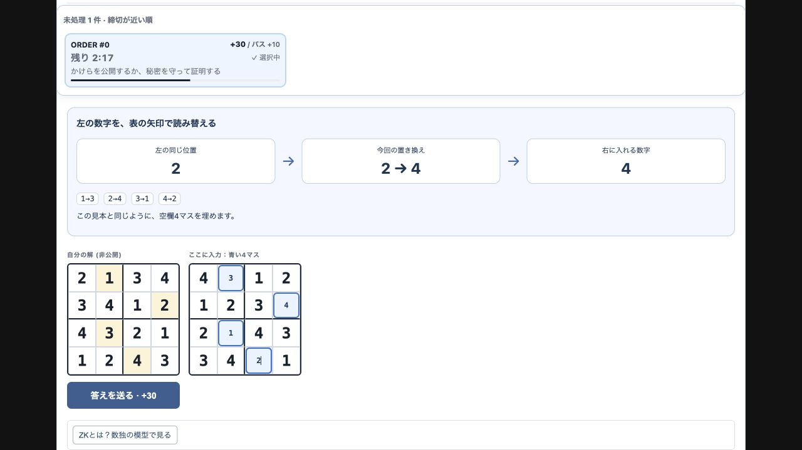
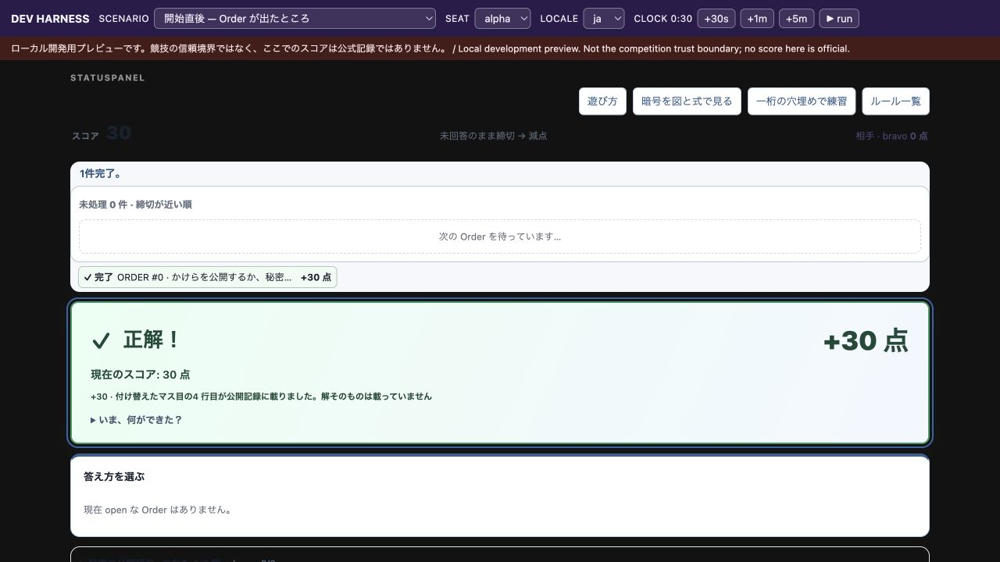
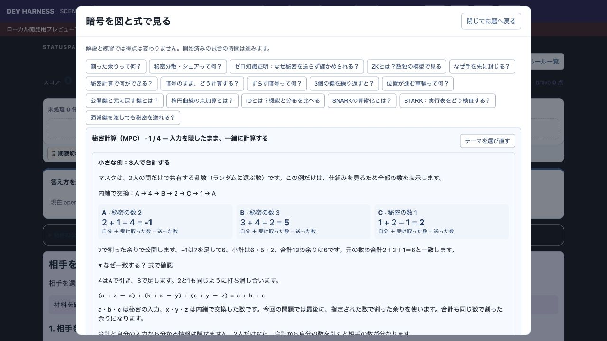
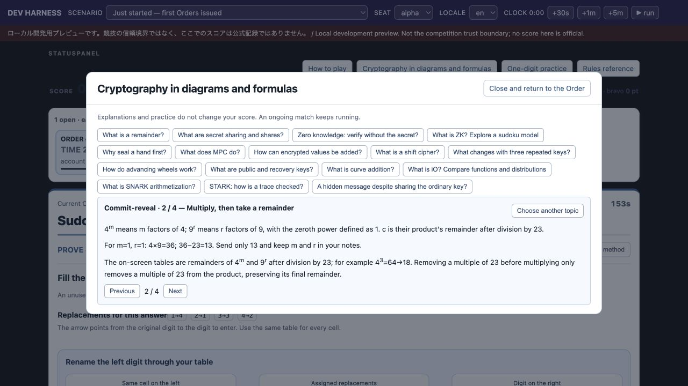

# Issue #780: participant flow acceptance

Checked on 2026-09-08 against Challenge `0f5e1957` plus the accompanying
problem-local changes. The parent Portal was checked at `7ce3da7f`.

The browser run used the real `StatusPanel`, `FastMovePanel`, worksheets and
reducer through this local harness at 1280 × 720. All answers below came from
participant-visible numbers and manual arithmetic. No hidden projection, source
answer, automatic solver or API submission was used in the playthrough.

## Findings and changes

| Acceptance item | Observed behavior and correction |
| --- | --- |
| Sudoku starts with four visible inputs | In `fresh`, opening PROVE immediately showed an automatically assigned unused table, the original board, 12 givens and four blue inputs. No table dropdown remained. The final visual hint still said to choose a table; it now describes the automatic assignment in JA/EN. |
| Sudoku draft survives polling | Entered the first two values, pressed the harness `+30s` control to trigger a new projection/client identity, and confirmed both values and the assigned table remained. Filled the remaining two values and submitted successfully. |
| MPC defines its masks and explains cancellation | The Order already used a three-person diagram; optional concept help still showed a two-person privacy claim. Both routes now share the three-person diagram, identify masks as privately shared random numbers, and show the same one-digit example and general cancellation equation. The explanation states that the result can reveal information: with only two people, the total and your own input determine the other input. |
| Caesar has five values and a submission example | The real Order showed five dice. JA/EN required five space-separated values, but the spacing example only had three. It now shows `1 2 3 4 5`. The input remains manual. |
| Powers are readable | Main commitment and Schnorr forms already used superscripts. RSA material, commitment concept help/practice, final hint prose and RPS attack explanation still rendered caret notation. They now render short powers with `` while preserving multiplication and remainder steps. |
| Public records and private vault have distinct purposes | The real panel explains that public records are readable by opponents, are not an answer form, and lead to the attack panel. The vault explains that opening it does not publish its contents. These existing controls were verified in the browser; their data handling did not change. |
| Shares, MPC and Sudoku are distinguished | JA/EN now define a share as numbered secret-sharing data and MPC as joint computation with private inputs. The Sudoku explanation explicitly limits its trusted-judge model; it no longer calls the entire game non-ZK when separate Schnorr Orders exist. |
| Normal problem information remains first | The real parent `ProblemDetail` composition renders normal problem information/environment content before plugin content. All 45 `ProblemDetail.test.tsx` tests passed, including normal problems and retained drafts across polling/lifecycle changes. This change adds no Battle-specific platform branch. |
| Frames, success reaction and selected input remain usable | At the checked desktop size, boards, inputs and diagram cards aligned. Successful Sudoku, MPC and Caesar submissions displayed the large result banner, the actual `+30` change and the updated score. The result received focus. |
| Harness resets do not show a previous scenario | Moving from a later clock to an earlier scenario previously retained the old view because production stale-poll protection correctly rejected the older same-team clock. The harness now remounts `StatusPanel` when the scenario changes. Browser regression: `streaming` at 2:00 → `fresh` at 0:00 immediately showed the fresh Sudoku board and its four-minute legacy deadline, without a reload. Ordinary polling still preserves drafts. |

## Hand calculation and result evidence

| Run | Visible input and calculation | Result |
| --- | --- | --- |
| Sudoku, JA, `fresh` | Assigned mapping `1→3, 2→4, 3→1, 4→2`. Original hole values `1, 2, 3, 4` became `3, 4, 1, 2`. The first two inputs survived a `+30s` projection refresh. | `正解！`, `+30`, current score 30, one public record. |
| MPC, JA, `mpc-order`, Order #4 | Own input 95; received `72+42=114`; sent `11+87=98`; `95+114−98=111`; `111−97=14`. Entered 14, refreshed with `+30s`, confirmed 14 remained, then submitted. | `正解！`, subtotal 14, `+30`, current score 30. |
| Caesar, EN, same match, Order #1 | Originals `4 1 3 4 5`, key 4, six symbols. Add 4 and wrap modulo 6: `2 5 1 2 3`. This exact text survived `+30s` and newly arriving Orders before submission. | `CIPHER SUCCESS`, `+30`, current score 60, nothing published. |

The Sudoku table is freshly assigned, so a later run can show a different table;
calculate from the arrows visible in that run. The `fresh` and `mpc-order`
fixtures intentionally exercise retained legacy tasks. `streaming` independently
showed the current one-minute Orders arriving at 30-second intervals, with
Schnorr as the proof route.

The MPC diagram is a small arithmetic model for private aggregation. It is not
an implementation of the dropout handling or adversary models in a deployed
secure aggregation protocol. Background: [Bonawitz et al., Practical Secure
Aggregation for Privacy-Preserving Machine Learning (CCS 2017)](https://research.google/pubs/practical-secure-aggregation-for-privacy-preserving-machine-learning/).

## Verification boundary

- `make install` and `make agent-gate`: 116 catalog entries valid.
- Game and dev TypeScript checks pass. The four targeted game/portal suites
  (`concept-explanation`, `hint-projection-regressions`, `portal`, `math-text`)
  pass 169 tests / 717 assertions, including real-component math/diagram checks.
- Dev harness suite: 85 tests pass.
- Parent actual React DOM suite: 45 tests pass at `7ce3da7f`. Its plugin slot is
  mocked; the browser run above covers the real Battle plugin separately.
- No production deployment, production authentication, official score-event
  persistence, or phone-sized browser run was performed in this acceptance pass.
  Local result banners and scores are UI/reducer evidence, not official scoring.
- The harness toolbar pauses its server clock, while the real component still
  animates a local countdown between projections. Change scenarios to start a
  fresh fixture; do not confuse a paused server clock with frozen UI time.
- A duplicate full-game run was stopped during the long state-size cases;
  no full-suite completion is claimed here. That run had passed the three
  12-team size scenarios before interruption. The scoped UI verification above
  is complete; full size regressions remain part of normal PR CI.

This record covers #780's participant flow criteria. It does not declare every
cryptography curriculum Issue, every game task, or the entire platform complete.
