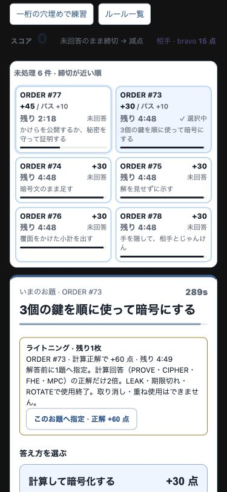
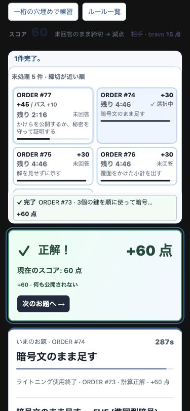
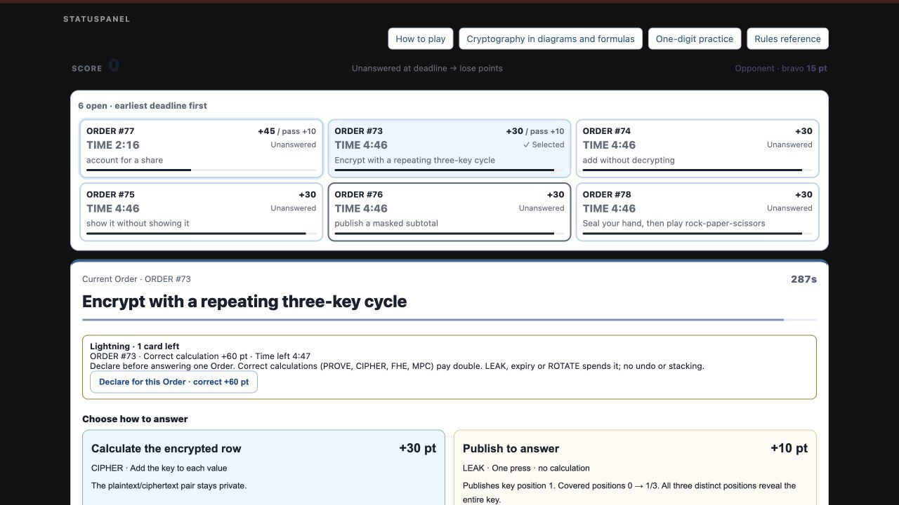
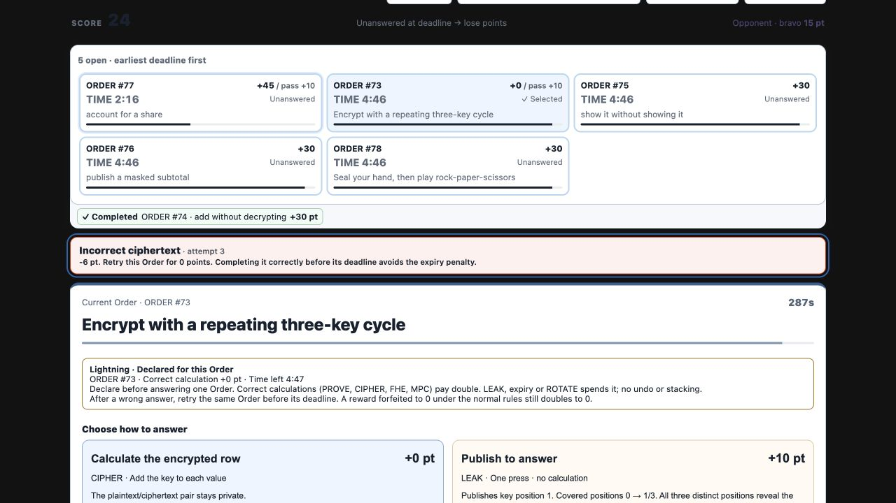

# Lightning: local participant route, 2026-09-06

This increment implements #659 §9's single-use lightning card. It does not
complete the remaining RSA, rotor or homomorphic cipher ladder rungs.

## Participant route

The `lightning` scenario uses the normal 90-minute configuration. Real ticks
and bravo's actual calculation answers reach minute 61, after the existing
endgame allocation at minute 60. The scenario does not write a card, winner or
completed Order directly. The dedicated server used port 5678, and the browser
rendered the real StatusPanel, FastMovePanel and Lightning components.

An author walkthrough at 375×812 used only the displayed values for arithmetic:

1. Alpha's score was 0, bravo's 15. Alpha saw **1 card left**, selected
   **Order #73**, **correct calculation +60**, and the Order's existing
   five-minute deadline. Its ordinary reward was +30 and LEAK was +10.
2. Pressing **Declare for this Order** changed the card to declared and the
   selected Order's calculation buttons and queue reward to +60.
3. Selecting FHE Order #74 kept that Order at +30 and exposed **Return to the
   declared Order**. Pressing it selected #73 again; no second card or target
   selection was available.
4. The selected Vigenère task showed key position 1, key **4** and original
   value **4**. The author calculated `4 + 4 = 8`, then `8 - 6 = 2`, entered
   **2**, and pressed CIPHER.
5. The real reducer response showed **+60**, total score **0 → 60**, completed
   Order #73, and **Lightning spent · Order #73 · Correct calculation · +60**.
   Order #74 became selected at its ordinary +30 reward. The public exposure
   display remained 0/3, consistent with the private CIPHER submission.

After integrating main 30003d4 (including #751 and #753), the same declaration
and +60 result were repeated through the connected Chrome browser. A width
check at 375×812 returned `clientWidth = scrollWidth = 375`. Selecting #73
scrolled the existing queue so the target, reward, deadline and declaration
button were visible together. The declaration also fit at 1280×720 in English.

A separate English walkthrough declared #73, then completed the unselected FHE
Order #74 for its normal +30: displayed pairs `(8,50)` and `(74,0)`, divisor 97,
give `(82,50)`. Submitting the deliberate incorrect value `3` on #73 changed
the score **30 → 24**, kept the same card target, and displayed a **0-point
retry**. Submitting the correct `2` then completed #73 for **0**, left the score
at **24**, and showed **Lightning spent · Order #73 · Correct calculation · +0**.
The existing Vigenère reward forfeiture therefore survives the multiplier.

The harness clock was paused for this UI inspection. Its client countdown
continued to age between responses and reset to the projected time on refresh.
This proves the local declaration/answer/result route, not first-time reading
speed or a human's time to solve. Deadline behavior is separately exercised by
real reducer transitions in the regression suite.

## Regression coverage

`game/src/lightning.test.ts` exercises the real game host, reducer, projection,
declaration client helper and Portal components:

- one/two/multiple teams; ties at the bottom-two cutoff; ready/start time shift;
  fixed allocation despite later score changes and repeated/late ticks;
- PROVE, CIPHER, FHE and MPC double exactly the selected calculation reward;
  configured standard and rush rewards also multiply without new constants;
- a recorded prior PROVE miss or Vigenère failure forbids declaration;
  malformed inputs retain the existing rejection behavior;
- an armed card survives an accepted PROVE miss, then a correct retry earns
  double with the existing wrong-answer penalty unchanged;
- an armed Vigenère miss retains the target but sets its reward to zero; a
  later correct answer completes for zero, including after JSON reload;
- LEAK earns its ordinary reward; ROTATE, expiry and match end spend the card;
  neither penalties nor DUEL win/draw/forfeit rewards are multiplied;
- repeated declaration/submission, attempted retargeting, pruning and reload
  do not create another award or score; only the receiving team's projection
  contains its card/target;
- migration from schema 8 preserves Vigenère failure, compact HUNT/RPS data
  and hint support; old Orders with unknown accepted-answer history are
  ineligible, while newly issued Orders can be declared;
- runtime guards reject malformed card projections and stored card records;
  locally aged deadlines display a pending verdict rather than inventing one.

Validation at base 30003d4 plus this increment:

- game: `bun run typecheck && bun test` — 664 pass, 0 fail, 43 files, including
  the merged RPS prediction-window and Order-focus regressions
- dev: `bun run typecheck && bun test` — 58 pass, 0 fail
- repository: `make install && make agent-gate` — pass, 116 metadata entries
- `git diff --check` — pass

The local browser used synthetic developer data. Parent Portal composition,
real-device keyboard behavior, Cognito, database delivery and a live AWS event
were not exercised. No AWS, release, container or shared port 5657 was used.

