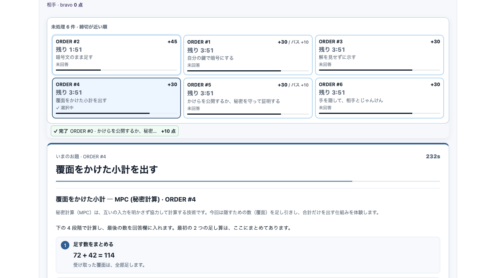
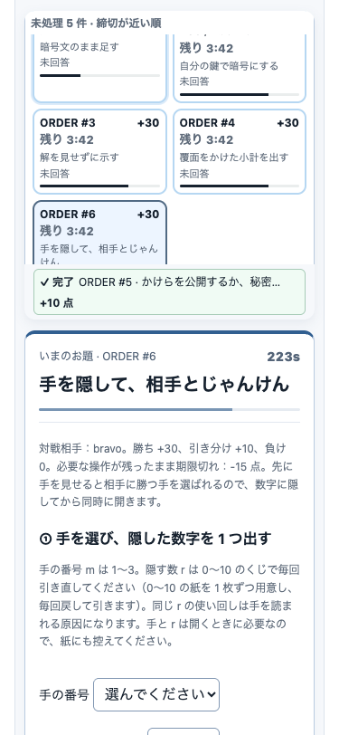

# お題一覧のローカル受け入れ確認 — Issue #741

2026-09-06、`cd6cedb` を基点とする本変更を、専用の `PORT=5661 bun run dev` と
実 Portal コンポーネントで確認しました。既存の 5657 と共有 AWS は操作していません。
ゲームの配布間隔・TTL・採点・検証規則は変更していません。

## 操作と観測

| 操作 | 観測した結果 |
| --- | --- |
| `fresh` の最初のお題で「公開して答える」 | 完了結果に +10 点。一覧の下にも `ORDER #0`、`完了`、`+10 点` が残る。 |
| 開発用時計の `+1m` | 次の 6 件が到着。未処理件数と「到着」付きカード、短い通知が出る。 |
| 1280×720 でカードを選ぶ | 3 列×2 行の 6 枚が全部見える。選択後の下段カード下端は約307px、一覧表示領域下端は約320px。回答欄上端は約370px。 |
| CIPHER の入力に `123` と入力し、時計を `run` にしてその欄へ戻る | 6 件から 17 件になる間も、入力値 `123`、`activeElement` の `fast-cipher-answer`、選択 `alpha-c1` が変わらない。 |
| 締切まで 30 秒以下へ進める | `締切間近` と残り時刻が文字で見え、点滅しない。 |
| 期限をまたぐ | 期限切れのお題は回答用一覧から外れ、直近の結果に `期限切れ` とお題番号が残る。新しいカードも同じ一覧へ加わる。 |
| 375×812 でカードに Tab / Space / Enter | Space で #5 を選択し、Tab と Enter で #6 を選択。フォーカスも #6。本文幅は375pxで横はみ出しなし。通知がない状態の件数見出し上端12px、一覧下端約353px、回答欄上端約365px。 |
| `prefers-reduced-motion: reduce` | カードの computed `animation-name` は `none`、タイマーの `transition-duration` は `0s`。 |
| locale を `en` に変更 | `Open Orders`、`Unanswered`、`Selected`、残り時間と英語の種類を表示し、選択を維持する。 |

初めてのお題を選ぶための折り畳み操作はありません。一覧は回答中も追従し、
件数が多い場合と狭幅ではカード領域だけをスクロールできます。
件数見出しと直近の結果は、カードをスクロールしても確認できます。
到着通知は15秒で消え、毎秒のカウントダウンを読み上げ通知へ流しません。

開発用の固定ツールバーが一覧を覆っていたため、ハーネスのツールバーを通常の
文書フローへ戻し、長いシナリオ選択欄を画面幅内に収めました。
この変更は開発ハーネス専用です。

## 検証の範囲

- 子 `make agent-gate`: 116件の metadata が有効。
- `game`: 567 tests、`dev`: 49 tests が成功。両パッケージの typecheck も成功。
- 回帰テストは実 reducer の初回→6件配布、完了、ポーリング間の期限切れ、
  秒更新を到着通知にしないことを確認する。
- 獲得点のカード表示は、この画面で確認した回答結果を使う。再読込をまたぐ得点履歴は作らない。
  じゃんけんの決着点は既存の専用結果欄に表示する。
- ローカル操作は本番への配信、認証、tenant isolation、永続化、公式スコアの証拠ではない。
  実 AWS の確認は未実施。親 Portal の検査結果は PR に記録する。
