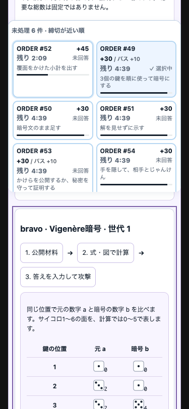
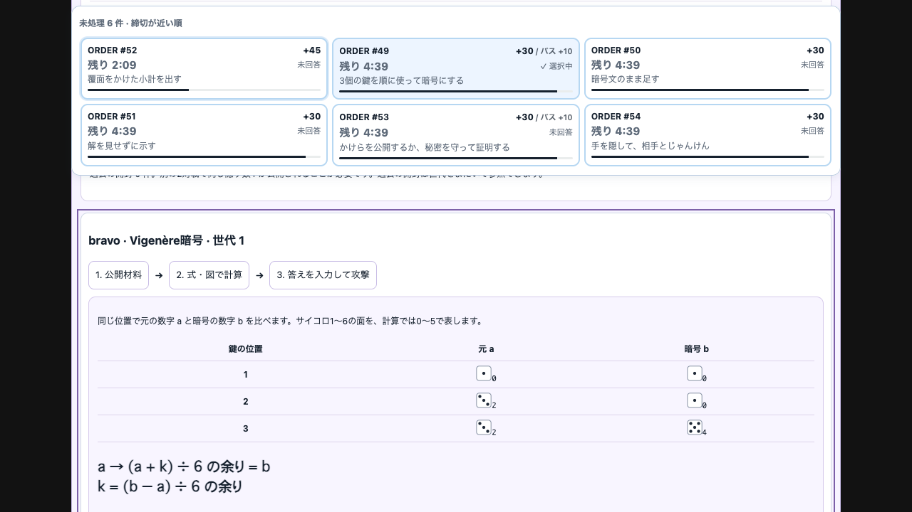
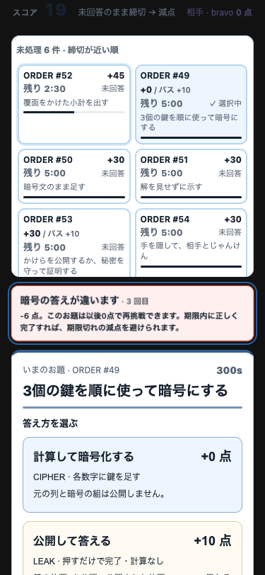
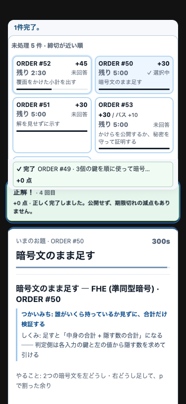

# Vigenère: local participant route, 2026-09-06

Scope: the next cipher rung in #659, following #661's private trusted-judge
CIPHER and time-based progression. This does **not** complete the remaining
RSA / rotor / homomorphic rung or lightning work.

## What was exercised

The normal 90-minute configuration was used: pressure starts at minute 30,
standard Orders last five minutes. The `vigenere` scenario reaches minute 41
through the real reducer and three actual bravo LEAKs. No synthetic completed
state or recovered-key field is inserted. The isolated server listened on
`localhost:5674`; the dedicated `ladder659` headless browser used the real
`StatusPanel`, `FastMovePanel`, and `HuntPanel` components.

The first author walkthrough read only the displayed task and public attack
worksheet for its arithmetic:

- Own Order #49 showed a three-key cycle, highlighted **key 3**, plaintext value
  **0**, and the shift **3**. The author computed `0 + 3 = 3`, entered `3`, and
  pressed CIPHER. The screen showed **+30**, score **0 → 30**, and “nothing
  published”; the next Order became selected.
- The attack worksheet showed public key positions **1, 2, 3**, with original →
  encrypted values **0→0**, **2→0**, **2→4**. Subtracting and adding 6 if negative
  gives keys **0, 4, 2**. Entering `0 4 2` produced **+25**, score **30 → 55**,
  and **Already attacked**. Bravo's score went **10 → 0**, correctly stopping
  the 12-point deduction at the score floor.
- The first narrow screenshot exposed cramped inline position/value labels.
  They were replaced by the three-column table below. Selecting an attack now
  scrolls its heading below the existing sticky Order queue. A DOM width check
  at **375×812** returned `clientWidth = scrollWidth = 375`. Both Japanese and
  English labels, the three-value input, and **1280×720** rendering were checked.

A repeat used the harness's **running** clock, starting at **41:00**
(13:18:18 UTC observation). CIPHER was submitted by the 13:18:35 UTC tool result;
by game clock **41:34**, the screen confirmed +30. HUNT was accepted and the
clock paused at **43:22**, within the original five-minute window. This is an
author repeat, **not** an independent first-time reading-speed measurement.
The fixture had already been seen; the roughly 17 seconds do not establish
novice comprehension speed.

The automated regression separately opens all three hints for one selected
Order through the real host, reads its own projection, performs the written
addition, and submits through tick → validate → apply at 120 seconds. This
covers both languages. It measures no human reading time.

## Regression evidence

`game/src/vigenere.test.ts` checks the general repeated-key example, full-pair
recovery, scheduled-time progression under delayed ticks, an open pre-boundary
Caesar Order, private CIPHER, malformed input, and repeated submission. Three
public records at just one key position still fit **36** different complete
keys and keep the attack route in “Waiting for evidence”. Three distinct
positions allow a public-only calculation; successful HUNT is once per
attacker/rung/generation. ROTATE retains public history but rejects the retired
generation. JSON/compact-ledger round trips retain public offsets, and schema-6
Caesar state migrates without changing its existing values or booster decision.

Validation on this increment:

- game: `bun test` — **629 pass**, 0 fail (41 files)
- game: `bun run typecheck` — pass
- dev: `bun test` — **55 pass**, 0 fail
- dev: `bun run typecheck` — pass
- repository: `make install` and `make agent-gate` — pass, 116 metadata entries
- `git diff --check` — pass

Screenshots show developer-only synthetic data, not a participant seed or a
live match. The browser route proves the local component/reducer loop. It does
not prove parent Portal integration, real-device keyboard behavior, Cognito,
DynamoDB/Turso, AWS deployment, or a multi-person paper playtest. Those were
not run. No AWS, release, shared port 5657, or container was used.

## PR #751 review follow-up

The review found that the original server did not enforce the displayed public
coverage condition, that six answer guesses could always collect the CIPHER
reward, and that free explanations included the paid guide. Those paths are
now separate and covered by the same real reducer/Portal tests.

Schema 8 stores a well-formed Vigenère miss and its actual score delta. It
charges the existing wrongProve price and forfeits that Order's CIPHER reward;
correct retry completes for zero and avoids expiry. Malformed input does not
count. The public HUNT prerequisite is enforced for the exact team, generation
and rung. No new timer, resource, fixed price or attempt-budget setting is added.
A lucky first guess remains possible; six attempts cannot guarantee the reward.

On a dedicated headless browser and localhost:5676, using only the displayed
values, the author checked the Japanese 375×812 screen and English 1280×720:
public pairs 0→0, 2→0, 2→4 yielded keys 0,4,2 and +25. Submitting the incorrect
cipher value 4 for original 0/key 3 charged −6 (25→19); the Order and button
changed to +0. Submitting the calculated 3 completed it with +0 (score stayed
19), without a new public record. A fresh replay's first correct 3 earned +30.
The view's document width and scroll width were both 375. The clock was paused
for this regression; no reading-speed measurement is claimed.

The free card and concept reader now provide the problem values, a general
formula and unrelated examples. They do not import the paid three-rung guide
or generate its live-value procedure. Purchased hint text still appears through
the own projection. The English formula defines original value and key instead
of assuming the word “operands”.

Verification: full game 635 pass (41 files), dev 55 pass, both typechecks and
catalog 116 entries pass. The focused migration/Portal/Vigenère suite also
passes after the final copy changes. AWS, real-device keyboard input and parent
Portal integration remain untested by this headless component harness.

