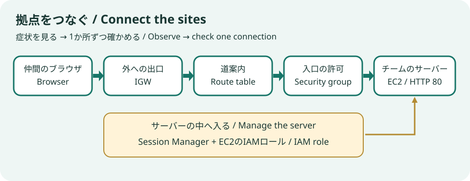

# Office Link — AWS Recovery Battle

[日本語](README.ja.md) · [Host runbook](OPERATOR.md) · [Plan #884](https://github.com/susumutomita/TenkaCloudChallenge/issues/884)

Four teammates from different offices meet at one venue and repair real AWS settings to keep their site reachable. Taking turns operating and explaining creates a shared learning experience and a reason to talk. Complete [Office Link Preparation](../../challenges/office-link-gate/README.md) first: launch EC2, connect an internet gateway, add a route, connect through Session Manager, and permit HTTP. The Battle provisions a **separate EC2 and VPC**.



## Participant route and scoring

Copy **HealthUrlHint** from portal Deployment outputs into the **Site health** endpoint slot unchanged, then open **GameUrl**. Use Open AWS Console in the portal to enter the team role. Match resource IDs with the board.

One host-triggered fault → discuss the symptom and diagram → repair in AWS → check the real resource → explain → rotate operators. Roles are operating, reading the diagram, explaining, and checking. Free hints are available. Answering a question does not repair AWS.

Existing `uptime-flat` awards +100 per successful scoring tick and −100 per failed tick (normally every minute). The default endpoint is empty until participant registration; deployment alone earns nothing. Explanations do not award extra points. Separate partner exchanges award up to +60 as described below; there is no flag submission. Official score, rank and end time remain in the portal. Allow roughly 30–45 minutes for four recoveries, plus about 40 minutes for Preparation. These are unmeasured planning estimates.

## Four roles and partner exchanges

The host privately gives one A–D card link to each teammate. A card reveals only that person's clue. Combine numbers, reconstruct the network path, then exchange two halves of a key across pairs. Every card must confirm the shared result. Recovery checks and explanations require different designated cards, rotating A → B → C → D over the four rounds. AI can help calculate; it cannot submit another person's confirmation without their card.

The portal also offers **Connect with another team**. Exchange the displayed codes in person and each submit the other team's code. Only reciprocal confirmations award +20 to both teams, once per pair, up to three different partners (+60 per team). A capped team can help a new partner without earning more. Waiting, cancellation and declined invitations have no penalty. Uptime scoring continues independently; the existing coordination host adds the bonus without replacing the uptime total.

Card possession is the authority, not proof of a distinct human. Someone given all cards or all team credentials can act for everyone. Hosts distribute cards separately and encourage discussion. For absence, the host can mark missing confirmations as assisted and reassign the missing person's card to a present teammate; see the runbook.

## Runtime and authority

Use one competitor AWS account per team. Each stack creates a VPC, subnet, gateway, route, fixed ENI, public IPv4, t3.micro EC2 with an 8 GiB gp3 disk, and Session Manager role. The page and observation service are preinstalled. Port 80 serves the page; port 8080 exposes only non-secret connectivity/check observations.

The participant Lambda reads resources, associates only the reserved address, and checks rounds. A separate operator-only Lambda changes the gateway, route, role, or HTTP rule. It has no public URL and participants cannot invoke it. A dedicated on-demand DynamoDB table stores round state with conditional writes; concurrent starts/restores are rejected. ExternalId is retained, with mutations and PassRole restricted to this lab.

Lite's existing fault execution uses SSM. Because these network/role faults can remove SSM access, this problem uses its own operator Lambda and recovery timer. It still uses **existing CFN deployment, endpoint registration and uptime scoring**, with no problem-specific platform code. See [redteam/README.md](redteam/README.md).

Health checks observe the real EC2 response, outbound HTTPS, network rules, and management role. The management round also requires a new Session Manager session and check-file update after the round started. A one-minute watchdog starts recovery after ten unrecovered minutes. Failed restores retry after a lease of at least three minutes; only successful recovery advances to explanation. Lost points are not refunded.

## Costs and teardown

Default Region: Tokyo (`ap-northeast-1`). EC2, EBS, allocated public IPv4 even while unused, Lambda, one-day logs, DynamoDB, the EventBridge timer and transfer can incur charges. No NAT Gateway, RDS, Secrets Manager or customer-managed KMS key is added. This problem's round table uses DynamoDB independently of the platform database choice. Do not promise zero cost.

Delete the problem deployment from the admin console after the event. The timer and public URL close before the CFN cleanup hook detaches the address, terminates/waits for the lab EC2 and removes its gateway. Verify stack deletion and absence of EC2/EBS/IPv4/gateway/functions/logs/table/timer. Failed cleanup stays visible; fix the cause and retry. Updating code does not reset a round; use a new deployment for a new event.

## Verification

Requires Python 3.12+, Node.js and Bun 1.3.11.

```bash
python3 -m venv /tmp/office-check
/tmp/office-check/bin/pip install -r ../../runtimes/aws-intro/requirements-test.txt
PATH=/tmp/office-check/bin:$PATH make test
make preview  # UI fixtures only: no real AWS or official score
```

The shared [aws-intro runtime](../../runtimes/aws-intro) supplies the AWS checks. `build.py` bundles code and assets into `template.yaml`. Also run `make install && make agent-gate` at the catalog root. [VALIDATION.md](VALIDATION.md) separates local evidence from the optional, unperformed AWS rehearsal.

CFN lint W2010 warnings reflect the existing capability-URL output contract. NoEcho does not hide Outputs. The participant role cannot read CFN outputs; share GameUrl only within the team.
