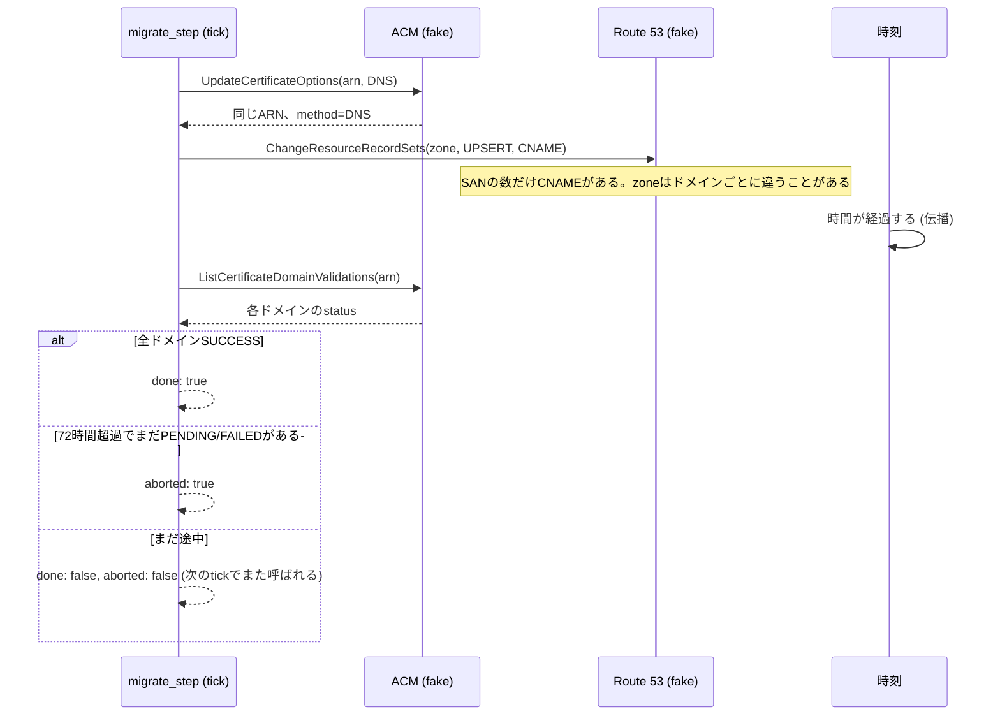

# 証明書のARNは変えずに、検証方式だけを乗り換える

**Order:** 独立問題 (トラック無し) · **難易度:** 3 (中級) · **所要:** 45–60分 · **配点:** 200 ·
**実行環境:** Python標準ライブラリのみ (オフラインsimulator、実AWS不使用)

## 前提 — 中学・高校の数学から

- **学校で習ったこと**: 中2の1次関数で習った「対応表」は、1つのx に1つのy が決まる関係だった
  (x=1のときy=4、x=2のときy=6、というように)。中1〜2の不等式は「9時に始めて5時間以内に終える」を
  9+5=14、つまり「終了時刻 ≤ 14時」という数の大小で表す考え方だった。そして「クラス全員」と
  「その中の日直だけ」のように、全体の集まり (集合) から必要な分だけを取り出した小さい集まりが
  部分集合である。この問題は、この3つ ―― 対応表・不等式・部分集合 ―― をAWSの証明書更新という
  実務にそのまま当てはめる。
- **教材のどこ**: 中学2年「1次関数」「連立方程式」に相当する対応関係の考え方、中学1〜2年の
  「不等式」、高校数学A「集合と場合の数」の部分集合の考え方に対応する。特別な予備知識は要求しない。
- **1 桁の例**: 対応表 x=1→y=4, x=2→y=6, x=3→y=8 で、x=2の行に間違ってx=1の値4を書くと表が
  壊れる ―― 証明書のドメインごとに正しいCNAME値を対応させるのも同じ仕組みである。9時に始めた
  作業を5時間以内に終えるには9+5=14時までに終える必要があり、14時ちょうどはセーフ (14≤14)、
  15時はアウト (15>14) ―― 72時間以内の移行も同じ「時刻の差の不等式」である。生徒5人
  {A,B,C,D,E}のうち日直はBとDの2人だけなのに、日直の仕事を5人全員に許可するのは、必要な2人
  という部分集合より広すぎる ―― DNSの書込み権限も、必要なzoneやレコードだけの部分集合に絞る。
- **言葉**: 対応(表) = 1つの入力に1つの正しい出力が決まっている関係。不等式 = 「〜時間以内」を
  数の大小で表したもの。集合・部分集合 = ものの集まりと、その中の必要な分だけの小さい集まり。
  ARN = 証明書の変わらない名前 (識別子)。SAN = 1枚の証明書がカバーする追加のドメイン名。
  CNAME = 「このドメインの持ち主である証拠」としてDNSに置く値。hosted zone = そのドメインの
  DNSレコードを実際に管理している場所。least privilege (最小権限) = 必要な部分集合だけに
  権限を絞る考え方。

## なぜ必要か

AWSは既存ACM証明書のvalidation method切替 (email → DNS) を提供し、emailでの新規発行を
2027-03-31以降、更新を2027-09-30以降に停止する予定である。締切前に移行する必要があるが、
証明書を作り直すとARNが変わり、参照している全リソース (ALBリスナー、CloudFrontディストリビ
ューション、API Gatewayカスタムドメインなど) を付け替えることになる。この問題では、**ARNを
変えずに検証方式だけを乗り換える**手順を実装する。



## Participant-visible contract

`migration.py` を編集し、次を定義する。

```python
migrate_step(client) -> {"certificates": {"<arn>": {"done": bool, "aborted": bool}, ...}}
```

`migrate_step` はスケジューラの1 tickを表す。Portal と hidden verifier は、これを**繰り返し
呼び出しながら擬似時刻を進める** (実sleepはしない)。1回の呼び出しは冪等でなければならず、
`client.list_certificates()` が返す**すべて**の証明書について、必ず1エントリを返す。

`client` が提供する主なメソッド:

- `list_certificates()` / `describe_certificate(arn)` / `list_certificate_domain_validations(arn)`
- `hosted_zone_for_domain(domain)` — そのドメインを実際に管理しているhosted zoneのidを返す
- `update_certificate_options(arn, "DNS")` — ARNは変えずにvalidation methodだけを切り替える
- `declare_dns_write_policy(statements)` — この移行で使うDNS書込み権限を宣言する
  (`Effect`/`Action`/`Resource` を持つ文の配列。宣言していないzoneへの書込みは`AccessDenied`になる)
- `change_resource_record_sets(zone_id, "UPSERT", name, "CNAME", value)` — CNAMEを冪等に書く
  (`"CREATE"`で既存recordへ再度書くとRoute 53と同様に失敗する)
- `now()` — 現在の擬似時刻 (秒)。証明書のmethod切替時刻 (`optionsUpdatedAt`) からの経過が72時間
  (`fixtures.aws_lab.DEADLINE_SECONDS`) を超えたら、それ以上の書込みをしてはいけない
- `call_log()` / `debug_policy()` / `debug_validation_state(arn)` — 自分の呼び出し履歴と、
  宣言した権限、各ドメインの内部状態を自己点検できる (何かを隠す秘密ではない)

`request_certificate(...)` と `delete_certificate(arn)` も存在するが、**呼んではいけない**。
実AWSと同じくAPI自体は成功するが、証明書identityを差し替えたことになり `preserve-identity`
checkpointで検出される。

## 意図的に不十分な公開テスト

出荷starterは公開テストをすべて通る。単一ドメイン・単一hosted zone・即時収束という一番簡単な
シナリオだけを見ており、複数SAN、delegated zone (別ownerのhosted zone)、72時間の締切、
「done」の意味そのものは一切検査しない。

hidden checkpointは1つずつ性質を積み上げる。

- `preserve-identity`: 証明書ARNを差し替えず、依存先の参照も変えない。
- `publish-records`: SANごとの正しいCNAMEを、正しいhosted zoneへ届ける。
- `least-privilege`: 宣言する権限が、実際に使うzoneの集合とちょうど一致する。
- `deadline-retry`: ゆっくり伝播するドメインでも72時間以内に収束し、二重retryでもエラーに
  ならず、72時間を過ぎたら書込みを止めてabortする。
- `verify-renewal`: 返り値の主張を信用せず、`describe_certificate` / 
  `list_certificate_domain_validations` への**再照会**で全ドメインSUCCESSとrenewal
  eligibilityを確認する。

この公開・hidden間の差が演習である。公開テストの green はこれらの性質を何も証明しない。

## Participant Portalでの進め方

1. 問題を起動する。問題ページにエディタと証拠操作が表示される。
2. 「証拠を確認」で、このデプロイの証明書一覧・SAN・依存先・DNSの管理者 (owner) を読む。
3. `migration.py` を編集し、公開テストを実行する。
4. `inventory` checkpointは証拠から数え上げた値をJSONで直接入力する。
5. 残り5つのcode checkpointを提出する。Portalは現在のエディタ内容を `/api/prepare` と
   `/verify` へ送る。

Workbenchとhidden verifierは別containerである。hostへ公開されるのはWorkbenchだけで、
`127.0.0.1:18620`からCompose-internal network上のverifierへ転送する。

## ローカルでの進め方

次のcommandにはDockerを使えるhost terminalが必要である。

```bash
make inspect          # 証明書一覧・SAN・依存先・DNS ownerの証拠
make test             # 公開テスト; starterは通る
make test-one ID=...  # test名の部分一致で1件
make up               # Workbench: http://127.0.0.1:18620
make down
```

作者とCIだけが使う。

```bash
make reference-test   # reference + hidden properties + 9 mutations kill
```

## Checkpoint

| id | 点 | 訊いていること |
| --- | ---: | --- |
| `inventory` | 20 | 全証明書・SAN・依存ARN・DNS ownerを数え上げる (JSON直接回答) |
| `preserve-identity` | 35 | 証明書ARNを差し替えない |
| `publish-records` | 40 | 全ドメインの正しいCNAMEを正しいzoneへ冪等publishする |
| `least-privilege` | 30 | DNS書込み権限を必要なzone/recordに限定する |
| `deadline-retry` | 30 | 72時間の締切、partial failure、retry/abortを状態機械として処理する |
| `verify-renewal` | 45 | 全domainのvalidatedとrenewal eligibilityを外部状態から確認する |

`preserve-identity` / `publish-records` / `verify-renewal` の3つがすべてpassし、かつ合計
160/200以上になることが、この移行が「完了した」とみなせる目安である。未編集のstarterは
`publish-records` (delegated zoneのSANが間違ったzoneに届く) と `verify-renewal`
(検証を確認せずに done を返す) が落ちるため、この基準を満たさない。

## 保証範囲

local modeはself-pacedなhonor-system verificationである。participantはmachine、Docker
daemon、imageを管理する。通常のparticipant imageはhidden test、reference、mutationを含まず、
hidden verifierは別imageである。それでもDockerを管理する人はauthor stageをbuildして中を
読める。この分離は誤配を防ぎ、悪意あるhost ownerから秘匿するものではない。submissionには
時間・memory・process・output capをかける。containerはnon-root、read-only、privilege無しで
動き、masqueradeされたoutbound networkを持たない。

競技順位・試験・修了判定は**支えません**。その用途にはparticipantが管理しないverifierが必要で、
[#271](https://github.com/susumutomita/TenkaCloudChallenge/issues/271)で追跡している。

## 証明したこと

証明書を再発行したのではない。同じARNのまま検証方式だけを乗り換え、SANごとの正しいレコードを
正しいDNS owner へ届け、72時間以内に全ドメインの検証完了とrenewal eligibilityを外部状態から
確認した。これは証拠に支えられる範囲を越えない、正確で役に立つ保証である。
