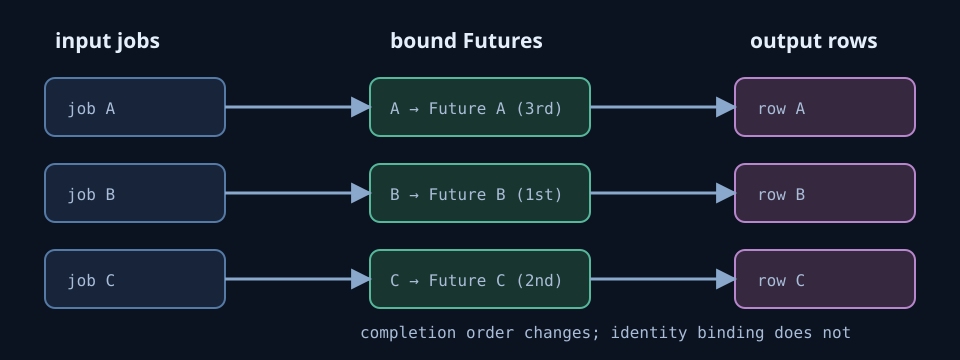

# Which request did that early result belong to?

**Track:** `cs-foundations` · **Order:** 30 · **Chapter:** 3. I/O and concurrency ·
**Time:** 45–75 minutes · **Points:** 200 · **Prerequisites:** Python functions,
lists/dicts, and basic `async` / `await`

## Why this problem exists

Five I/O operations each returned the right value. The batch still stored some values under the
wrong request IDs. Its public tests are green because they only use one request or complete work
in input order.

This problem isolates one leap:

> Every async operation is correct, therefore combining them is correct.

That does not follow. Combining them adds a new obligation: preserve the relation between each
request and its eventual result.

## Terms used here

- A **job** is one request description with a unique `id`, an endpoint, and a query.
- **Request identity** is the direct relation saying which job a result or failure belongs to.
- A Python **Future** is a box that later receives exactly one value or one exception.
- **Input order** is the order of `jobs`; **completion order** is the order Futures become ready.
- **Overlap** means multiple I/O jobs have started before the first one completes.

Completion order is not request identity. A URL is not request identity either: two different
jobs deliberately share one endpoint in the hidden cases.



```text
input order       A -------- value A --------> row A
                  B -- value B ----------------> row B
                  C ----- failure C -----------> row C

completion order  B, C, A        (different order; identity does not move)
```

## The collector contract

Edit one participant-owned file: `local/starter/collector.py`.

```python
async def collect(jobs, start_io): ...
```

`start_io(job)` returns an `asyncio.Future` immediately. Start every job before the first result
is released. Return exactly one row per input, in input order:

```text
success  {"jobId": job["id"], "ok": true,  "value": value}
failure  {"jobId": job["id"], "ok": false, "error": str(error)}
```

The gate does not sleep and does not make real network requests. It records starts, then resolves
Futures in an explicit seed-derived permutation. Simultaneous completion means two Futures are
resolved in the same release group; there is no timestamp to sort.

## A worked two-job observation

Suppose input is `[A, B]`, but Future B is released first.

```text
jobs                         completion iterator
A                            value-from-B
B                            value-from-A
```

`zip(jobs, as_completed(...))` produces `(A, value-from-B)` and `(B, value-from-A)`. Both values
are valid, so value-only assertions can pass. The association is still wrong. Binding each job
inside the coroutine that awaits its Future keeps the relation available after completion.

## Participant Portal workflow

1. Start the problem and open the problem editor on the same page.
2. **Inspect evidence**: compare `jobs`, `completionTrace`, and `storedRows`.
3. Enter the wrong stored-row indices as an ascending JSON array for `audit`.
4. Read and edit `collector.py`, then select **Run public tests**. The shipped starter passes.
5. Select **Prepare submissions**. Portal prepares `environment` and all four code values; it
   deliberately does not prepare the audit answer.
6. Submit the prepared values. The separate verifier checks independent hidden phases.

This is the complete path: `config → inspect → starter → test → prepare → verify`.

## Local workflow

```bash
make build
make inspect
make test                 # public suite; the shipped starter passes
make test-one ID=ordered  # select a public check by name
make reset
```

Authors and CI only:

```bash
make reference-test       # reference plus all seven mutations in the author image
```

To exercise the published Workbench on loopback port 18330 and its internal verifier:

```bash
docker compose -f local/docker-compose.yml up --build
docker compose -f local/docker-compose.yml down
```

The lab uses no cloud resources and has an estimated cloud cost of **0 USD**. It performs no
real network I/O. Source/harness checks and automated Docker API checks are documented validation;
a human Participant Portal playtest is not claimed until it has actually been recorded.

## Checkpoints

| id | points | property |
| --- | ---: | --- |
| `environment` | 10 | Read the deploy-bound Future gate phrase |
| `audit` | 30 | Identify rows stored under the wrong request identity |
| `overlap` | 30 | Start all required I/O before the first completion |
| `bind` | 45 | Keep values bound across reverse and partial permutations |
| `failure` | 35 | Keep later identities fixed after a middle failure |
| `generalize` | 50 | Handle shared URLs, varied permutations, and simultaneous readiness |

All four code checkpoints submit the same `collector.py`; each remeasures a different property.
Serialization is rejected because it deletes the overlap contract rather than repairing it.

## What this is not

`eventbridge-delivery-discipline` concerns delivery IDs, retries, business versions, DLQ receipts,
and replay across a messaging boundary. This problem ends inside one Python process: a request,
its Future, and the result association. It does not teach retries or exactly-once delivery.

## Assurance scope

Local mode is **self-paced, honor-system verification**. You own the machine, the Docker daemon,
and the image. The normal participant image omits the hidden checker, reference, and mutation
suite, and the deployed verifier is a separate image. That prevents accidental delivery in the
ordinary participant path; it is not a confidentiality boundary against somebody who can build
the author target from this checkout.

The verifier runs submitted code in a fresh temporary directory with timeout, memory, process,
file-size, and output limits. A checkpoint credits only the ID echoed in its response and does not
return hidden fixture values. Both services run as UID 10001 with a read-only root filesystem,
dropped capabilities, loopback-only published ports, and networks with no outbound path.

This supports honest self-study. It does **not** support competition ranking,
examination, or completion certification. Those require a verifier administered outside the
participant's machine, tracked in [#271](https://github.com/susumutomita/TenkaCloudChallenge/issues/271).
