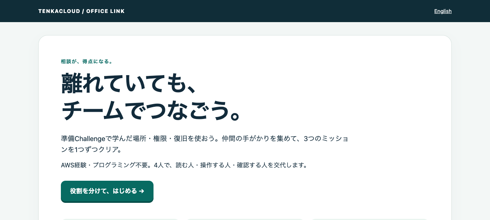

# つながるオフィス — 相談してひらくBattle

[English](README.md) · [60分の開催台本](OPERATOR.ja.md)

**AWS未経験者が、離れた拠点の仲間と話して得点するチーム戦。** 先に[準備Challenge](../office-link-gate/README.ja.md)で必要な知識を確かめます。役割カードの手がかりを合わせて直し、その理由を次の相談で説明します。



実装した問題のローカルプレビュー。正式な得点は既存ポータルで管理します。

| ミッション | 操作して得点 | 解説も問題にする | 配点 |
| --- | --- | --- | --- |
| 招待状を届ける | 受付メモと地図から宛先を選ぶ | 別の地域で同じ名前の設定を探す相談 | 15 + 15 |
| 案内だけを共有 | 誰に・何を・どこまで見せるか決める | 必要なアクセスと不要なアクセスの確認 | 20 + 15 |
| 消えた案内を復旧 | 記録と控えを比べ、復旧する | 画面は戻ったが新しい予約がない相談 | 20 + 15 |

4人、60分（準備Challenge20分・本戦25分・導入と振り返り15分）が初回の目安です。競技時間内の公式得点を競い、同点は同順位として表彰します。速度だけで初心者を置き去りにしません。操作と解説は独立した部分点で、問題画面のヒント・試行・未完了の減点はありません。ポータルの誤った合言葉には、難易度1の標準ルールで5点の減点があります。コピーして同じ番号の欄へ提出します。話した回数や発言の質は自動採点しません。

## 準備から本戦へのGate

イベントには `office-link-gate` と `office-link-battle` の2問だけを入れます。既存のProgression Gateを有効にし、[event-gate.json](event-gate.json)の設定で準備修了まで本戦をロックします。準備は途中で公式加点しない単一flag問題、本戦は6項目合計100点。イベント合計200点です。

本戦内も操作 → 解説 → 次のミッションの順にサーバーで確認します。未完了の課題は一度に1つ。終えた問題やミッションは復習できます。Gate設定はイベント側に置き、カタログの独自前提グラフは作りません。

## 参加者の最初の一手

ポータルの **GameUrl** → **役割を分けて、はじめる**。読む人はカードを開き、操作する人に手がかりを伝えます。成功したら合言葉をポータルの同じ番号の回答欄へ提出します。解説の前に操作担当を交代します。

参加者向けの説明は[metadata.json](metadata.json)、問題画面は日英対応です。ポータルの言語は別タブの問題画面へ渡らないので、必要なら右上の言語リンクを使います。採点欄の見出しは既存multi-flagの翻訳契約に合わせ日英併記です。

## 動く範囲

- 問題画面は、地域・アクセス権・バックアップの考え方を学ぶ**模型**。実際のS3やIAMを操作する演習ではありません。
- 正式開催は既存の **AWS / CloudFormation + multi-flag**。チームごとにLambdaとURLを作り、既存ポータルで6つの合言葉を照合・採点します。本体の専用分岐や新しい採点方法は不要です。
- 問題画面の成功表示は**未提出の控え**。得点・順位・提出済み判定はポータルが正本です。再提出しても二重加点しない既存の契約を使います。
- `make preview` は同じLambda handlerの画面・判定をlocalhostで動かすレビュー用。公式ポータル・チーム認証・順位・イベント時間は提供しません。既存の`make local`やローカル複数チーム開催の対応問題へ追加したとは扱いません。
- 役割カードは会話を促すための仕掛けで、閲覧権限を分離する機能ではありません。チーム内では全カードを読めます。役割交代を運営に組み込み、交流効果は実プレイで確認します。

端末を交代するときは、前の担当から最後に得た合言葉（AまたはB）を受け取り、同じGameUrlの「仲間から続きを引き継ぐ」へ貼ります。前の段階までの控えも復元します。同じ端末で交代する場合はそのまま進めます。

## 構成と安全な配信

`web.html / web.js / web.css` → `app.py`の判定 → 到達したチェックポイントだけの合言葉 → 既存ポータルで提出。

`build.py`がこれらを[template.yaml](template.yaml)へ埋め込みます。生成物は直接編集しません。別々の7個の乱数（アクセス用1個、採点用6個）を既存の`__RANDOM_PASSWORD__`で注入します。合言葉のOutputはmetadataの各`flagOutputKey`に対応し、既存ポータルが除外します。

GameUrl自体がチーム用のアクセス情報です。第三者へ転送せず、録画・公開Issue・アクセスログへ残さないでください。URLを知る人はそのチームの問題画面を使えますが、得点の書き込みには別途ポータルのチーム認証が必要です。問題画面は他チームのURLも採点用秘密値も取得できません。初期HTML・JS・カードには合言葉を入れません。

Lambdaの実行権限は自分のロググループへの書き込みだけです。参加者ロールは既存のサインイン・CloudShellセッションの最小共通設定を保ち、Lambdaコード・環境変数・CloudFormation Outputの読み取り権限を付与しません。`ExternalId`は必須です。アプリはリクエスト本文・合言葉をログへ出しません。

## 費用と撤収

初回リハーサルの対象リージョンは東京 `ap-northeast-1`。実AWSでの確認は開催者が行います。問題ごと・チームごとにLambda（128MB）、Function URL、1日保持のCloudWatch Logs、IAMロールを作成します。呼び出し・実行時間・転送・ログに利用量に応じた費用が生じ得ます。本体の費用も別です。無料になるとは保証しません。

この問題はEC2、NAT Gateway、RDS、S3バケット、Secrets Manager、カスタマー管理KMSキーを作りません。Function URLは公開到達可能なので、鍵なしの呼び出しをアプリで拒否してもLambdaの呼び出し自体は発生します。予算と終了後の撤収を確認します。

終了後は結果を保存し、管理画面から問題デプロイを削除。Lambda、URL、権限、ロググループ、ロールがスタックとともに削除されたことを確認します。プレビューは実行中の端末で`Ctrl-C`。ブラウザには受け取った合言葉の控えが残るため、共用端末ではこのサイトの保存データを消します。

## 開発・確認

カタログルートで`make install`後、このディレクトリで実行します（Python 3.12以上、Bunはカタログ指定版）。

```sh
make build
make test
make preview
```

表示されたlocalhost URLを開きます。ポート変更は`python3 preview.py --port 5685`。秘密値は起動ごとに生成され、ソースには保存しません。

その後、カタログルートで`make agent-gate`。AWSへ配信されるコードとプレビューの判定が同じこと、6チェックポイント、誤答・やり直し、チーム間の合言葉混用拒否、秘密値非露出、日英をテストします。[検証記録](VALIDATION.md)には実施と未確認を分けて記録します。

学習概念の一次資料：[AWSリージョン](https://docs.aws.amazon.com/global-infrastructure/latest/regions/aws-regions.html)、[IAMの最小権限](https://docs.aws.amazon.com/IAM/latest/UserGuide/best-practices.html)、[S3の過去版](https://docs.aws.amazon.com/AmazonS3/latest/userguide/Versioning.html)。配信方式は[Lambda Function URLのアクセス制御](https://docs.aws.amazon.com/lambda/latest/dg/urls-auth.html)に従います。
