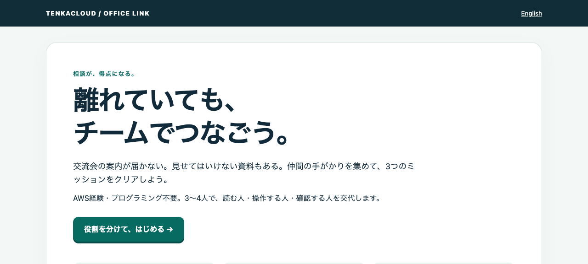

# Office Link — a GameDay built on conversation

[日本語](README.ja.md) · [60-minute host runbook](OPERATOR.md)



Local preview of the implemented workshop. Official scoring is handled by the existing portal.

**A team competition for colleagues who have never used AWS.** Combine role-card clues to repair a fictional event, then answer a new request to explain what you learned. It is designed for cross-office conversation, rather than individual tutorial completion.

| Mission | Repair | Scored explanation | Points |
| --- | --- | --- | --- |
| Deliver the invitation | Combine reception's code with a map | Find a named setting in the right region | 15 + 15 |
| Share just the invitation | Decide who may read which documents | Check required access and forbidden access | 20 + 15 |
| Recover the invitation | Compare the timeline with saved copies | Recover missing bookings after a page already works | 20 + 15 |

Start with 3–4 people per team and 60 minutes: 40 minutes of competition, 20 for introduction and reflection. Rank teams by the official score at the deadline; celebrate equal scores as ties. Repairs and explanations score independently. Workshop hints, attempts and unfinished missions carry no penalty. An incorrect portal passphrase costs 5 points under the standard difficulty-1 rule; copy it into the matching numbered field. Conversation frequency and quality are not automatically graded.

## First action

Open **GameUrl** in the portal and choose **Choose roles and begin**. Readers open a card and relay clues to the operator. Copy each earned passphrase into the matching numbered portal field and submit it. Swap the operator before the explanation.

Both the metadata and workshop are bilingual. Select English inside the workshop when needed; the portal does not propagate language to this separate tab. Portal checkpoint labels contain both languages within the existing multi-flag contract.

When switching devices, receive the repair passphrase (A) from the previous operator and paste it into **Take over the explanation from a teammate’s device** at the same GameUrl. On the same device, simply continue.

## Runtime and scoring

The missions are a **model of cloud concepts**, not a real S3/IAM console lab. Official hosting uses the existing **AWS CloudFormation + multi-flag** path: one Lambda and private capability URL per team, six independent flags, 100 points total. There are no problem-specific changes to the platform.

The workshop's success screen is a submission note, not an official score. The portal owns scoring, timing and duplicate-submission protection. Role cards encourage conversation; they do not enforce separate identities, and every teammate may read every card. Hosts rotate roles and validate the social outcome in a rehearsal.

The loopback preview runs the same Lambda handler. It does not provide official authentication, ranking or an event timer. This problem is not added to `make local` or the limited local multiplayer compatibility matrix.

## Packaging and security

`build.py` embeds `app.py`, `web.html`, `web.js` and `web.css` into `template.yaml`. Never edit the generated template directly. The existing deployment chain injects seven independent random parameters: one access capability and six scoring secrets. Only the earned checkpoint's flag is returned. All flag outputs are declared in metadata for the platform's existing redaction and scoring paths.

GameUrl grants access to that team's workshop. Share it only within the team; do not put it in public screenshots, issues or access logs. It does not authorize platform score writes or AWS account access. The app logs neither request bodies nor flags. Initial assets contain no scoring secrets. The execution role may write only to its own log group. The participant role retains the catalog's standard sign-in/CloudShell session permissions and required ExternalId, with no permission to read Lambda code, environment variables or CloudFormation outputs.

## Cost and teardown

Tokyo (`ap-northeast-1`) is the initial rehearsal target, not a claim of live verification. Each team gets a 128MB Lambda, Function URL, CloudWatch log group with one-day retention and IAM roles. Requests, execution time, transfer and logs can incur charges, in addition to the platform. There is no guaranteed zero-cost claim.

The problem creates no EC2, NAT Gateway, RDS, S3 bucket, Secrets Manager secret or customer-managed KMS key. The URL is publicly reachable: even requests rejected for a missing capability invoke Lambda. Hosts must set a budget and remove the environment after use.

Export results, then delete each problem deployment through the platform. Verify the stack removed its function, URL, permissions, log group and roles. Stop the preview with `Ctrl-C`. Clear this site's browser storage on shared devices because it contains earned passphrases.

## Local validation

Run `make install` at catalog root, then here with Python 3.12+ and the catalog's pinned Bun:

```sh
make build
make test
make preview
```

Open the printed localhost URL. For another port use `python3 preview.py --port 5685`. Preview secrets are generated on startup and are not committed. Run `make agent-gate` at catalog root afterwards.

Tests cover the deployed handler, six checkpoints, retries, cross-team receipt rejection, secret non-disclosure and both languages. See [validation evidence](VALIDATION.md) for executed checks and the live-AWS/multi-person rehearsal boundary.

Primary references: [regions](https://docs.aws.amazon.com/global-infrastructure/latest/regions/aws-regions.html), [least privilege](https://docs.aws.amazon.com/IAM/latest/UserGuide/best-practices.html), [S3 versioning](https://docs.aws.amazon.com/AmazonS3/latest/userguide/Versioning.html), [Function URL access control](https://docs.aws.amazon.com/lambda/latest/dg/urls-auth.html).
